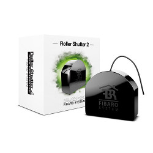
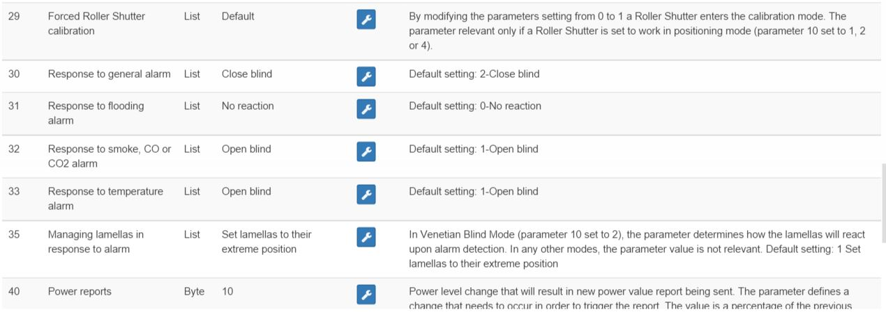

# Fibaro FGR-222 "Persiana enrollable"

**El módulo**

**El visual de Jeedom**

## Resumen

El micromódulo FGR-222 le permitirá gestionar las motorizaciones del obturador con parada electrónica, las persianas venecianas o incluso las puertas del garaje gracias al protocolo Z-Wave mientras mantiene su interruptor existente. Por lo tanto, podrá activar el motor conectado utilizando el interruptor existente, un transmisor Z-Wave o directamente desde el botón en el micromódulo.

Además, este micromódulo es capaz de transmitir el consumo eléctrico instantáneo (W) y acumulativo (KWh) del equipo conectado a él.

Es necesario un controlador Z-Wave (control remoto, dongle, etc.) para integrar este módulo en su red si ya tiene una red existente.

Cada módulo Z-Wave funciona como un repetidor inalámbrico con los otros módulos, para garantizar la cobertura total de su hogar.

Nota : Este módulo requiere neutral para operar.

## Fonctions

-   Controle sus persianas o persianas de forma remota
-   Compatible con BSO y persiana veneciana con posicionamiento de lamas
-   Se instala detrás de un interruptor existente
-   Arriba / abajo y función de posicionamiento
-   Compatible con motores con parada mecánica o electrónica
-   Medición del consumo instantáneo y acumulativo
-   Actualización inalámbrica con la caja Fibaro Home Center 2
-   Función de prueba de cobertura de red Z-Wave
-   Pequeño, discreto y estético
-   Facilidad de uso e instalación

## Características técnicas

-   Tipo de módulo : Receptor Z-Wave
-   Suministro : 230V, 50 Hz
-   El consumo de energía : &lt; 0,8W
-   Cableado : 3 hilos, neutro requerido
-   Carga máxima : 1000W
-   Frecuencia : 868.42 Mhz
-   Fuerza de la señal : 1mW
-   Distancia de transmisión : 50m de campo libre, 30m en interiores
-   Dimensions: 17 x 42 x 37 mm
-   Temperatura de funcionamiento : 0-40 ° C
-   Temperatura límite : 105°C
-   Normas : LVD (2006/95 / EC), EMC (2004 / 10B / EC), R & TTE (1999/5 / EC)

## Datos del módulo

-   Hacer : Grupo Fibar
-   Nombre : Fibaro FGR-222
-   ID del fabricante : 271
-   Tipo de producto : 770
-   ID del producto : 4096

## Configuration

Para configurar el complemento OpenZwave y saber cómo incluir a Jeedom, consulte esto [Documentación](https://doc.jeedom.com/es_ES/plugins/automation%20protocol/openzwave/).

> **Importante**
>
> Para poner este módulo en modo de inclusión, presione el botón de inclusión 3 veces, de acuerdo con su documentación en papel.

Una vez incluido, deberías obtener esto :

### Commandes

Una vez que se reconoce el módulo, los comandos asociados con el módulo estarán disponibles.

Aquí está la lista de comandos :

-   Estado : Es el comando que permite conocer la posición de su obturador
-   Posicionamiento : Es el comando que hace posible definir el porcentaje de apertura
-   Arriba : Este es el comando que le permite abrir completamente el obturador
-   Abajo : Es el comando que cierra completamente el obturador
-   Refrescar : Es el comando que permite preguntar nuevamente la posición del obturador
-   Potencia : Comando que permite tener el consumo del módulo
-   El consumo : Comando que permite conocer la potencia instantánea utilizada por el módulo
-   Detener : Control para detener el movimiento del obturador
-   DETENER BSO : Comando para detener el movimiento (en modo de lamas ajustable)
-   Inclinación : Le permite inclinar las lamas (modo de lamas ajustable)
-   Declinar : Permite disminuir las lamas (modo de lamas ajustable)
-   No : Se usa para definir el paso para presionar Rechazar o Inclinar

### Configuracion del modulo

Luego, si desea configurar el módulo de acuerdo con su instalación, debe pasar por el botón "Configuración" del complemento OpenZwave de Jeedom.

Llegará a esta página (después de hacer clic en la pestaña Configuración)

Detalles del parámetro :

-   1: permite bloquear el módulo (para congelar un obturador) (en el caso de presionar un interruptor)
-   2: lo mismo pero para los comandos zwave
-   3: tipo de informes (clásico o fibroso)
-   10: modo de funcionamiento (persiana veneciana, obturador, etc.)
-   12: duración de un turno completo (en modo de persiana veneciana)
-   13: le permite elegir cuándo los listones deben volver a su posición anterior
-   14: permite elegir el tipo de interruptor
-   17: permite elegir cuánto tiempo después del límite definido en 18 se detiene el obturador
-   18: potencia de seguridad del motor
-   22: NA
-   29: permite calibrar la aleta
-   30 a 35: permite definir el comportamiento del módulo frente a las diferentes alarmas zwave
-   40: delta de potencia para desencadenar un aumento de la información (incluso fuera del período definido en 42)
-   42: período de retroalimentación de información
-   43: delta de energía para desencadenar un aumento de la información (incluso fuera del período definido en 42)
-   44: permite elegir si el consumo y la potencia deben incluir o no los del propio módulo
-   50: permite elegir si el módulo debe enviar la información a los nodos en asociación en modo escena o en modo asociación

### Groupes

Este módulo tiene 3 grupos de asociación, solo el tercero es esencial.

## Bueno saber

### Reset

Puede restablecer su medidor de consumo haciendo clic en este botón disponible en la pestaña Sistema.

### Important

> **Importante**
>
> Para que la retroalimentación de estado funcione en Jeedom, es necesario forzar la calibración del equipo (parámetro 29 a "Sí") y el posicionamiento debe estar activo (parámetro 10 con los valores "Active direct", "Active Venetian "o" Puerta activa ").

### Visual alternativo

## Wakeup

No hay noción de activación en este módulo.
