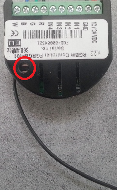

Controlador Fibaro RGVB - FGRGB-101 
=================================

-   **El módulo**

-   **El visual de Jeedom**

Resumen 
------

El micromódulo Z-Wave Fibaro FGRGB-101 le permite elegir entre
Luces de bajo voltaje de 12 / 24V (halógeno o LED), una tira de LED RGB
o RGB + blanco o incluso para conectar sondas analógicas usando
0-10 V estándar.

-   4 entradas analógicas de 0 a 10 V para conectar a muchos sensores
    compatible, potenciómetros, pulsadores (monoestable)
    o interruptores (biestables).

-   4 salidas de dimmer (PWM) para controlar :

-   \* es decir, 1 canal de RGB + LED blanco (RGBW) 12 / 24V

-   \* o 4 canales de LED blancos 12 / 24V

-   \* o 4 canales de lámparas halógenas de 12 / 24V (144W 12V / 288W 24V máx.)

-   \* o ventiladores 12 / 24V.

-   Requiere fuente de alimentación separada de 12 / 24V.

-   Medida de consumo global o instantánea o acumulativa.

-   Función de repetidor (enrutador) para extender la red Z-Wave.

Funciones 
---------

-   Ordene luces de bajo voltaje 12 / 24V (halógeno o LED)

-   Se instala detrás de un interruptor existente

-   Simulación de luz previamente programada

-   ON / OFF y función de variación

-   Pequeño, discreto y estético

-   Facilidad de uso e instalación

Características técnicas 
---------------------------

-   Suministro : 12 V o 24 V CC

-   Máxima potencia de salida :

-   \* 12A en total (suma de todos los canales),

-   \* 6A máx. por canal

-   Máxima potencia con lámparas halógenas :

-   \* 12V - 144W en total (todos los canales),

-   \* 24V - 288W en total (todos los canales)

-   Frecuencia de modulación PWM : 244 Hz

-   El consumo : 0,3W

-   Protocolo de radio : Onda Z a 868,4 MHz (UE)

-   Potencia de transmisión Z-Wave : 1mW

-   Temperatura de funcionamiento : 0 - 40 C

-   Para instalar en cajas : Ø≥50 mm

-   Dimensiones : 42 x 37 x 17 mm

-   Normas europeas : EMC 2004/108 / EC R & TTE 199/5 / WE

-   Este módulo requiere un controlador Z-Wave para funcionar.

Datos del módulo 
-----------------

-   Hacer : Grupo Fibar

-   Nombre : Fibaro FGRGB-101 RGBW

-   ID del fabricante : 271

-   Tipo de producto : 2304

-   ID del producto : 4096

Configuración 
-------------

Para configurar el complemento OpenZwave y saber cómo poner Jeedom en
inclusión refiérase a esto
[Documentación](https://doc.jeedom.com/es_ES/plugins/automation%20protocol/openzwave/).

> **Importante**
>
> Para poner este módulo en modo de inclusión, presione el botón 3 veces
> botón de inclusión, de acuerdo con su documentación en papel.

Una vez incluido, deberías obtener esto :

### Comandos 

Una vez que el módulo ha sido reconocido, los comandos asociados con el módulo serán
disponibles.

Aquí está la lista de comandos :

-   Color : Es el comando que permite configurar el código de color para
    afficher

-   Chimenea : Es el comando que simula una atmósfera de
    Chimenea

-   Tormenta : Este es el comando que simula una atmósfera de tormenta

-   Alba : Este es el comando que simula una atmósfera de Aude
    (amanecer progresivo)

-   Desvanecimiento : Este es el comando que simula todo
    espectro de color

-   RBB : Este es el comando que simula una atmósfera de policía

-   Blanco frio : Este es el comando que simula tener un
    color blanco frío, si la tira de color lo permite. (este
    el comando no es visible por defecto)

-   Blanco cálido : Este es el comando que simula tener un
    color blanco cálido, si la tira de colores lo permite. (este
    el comando no es visible por defecto)

-   Uno : Este es el comando que activa la tira en el
    último color elige antes

-   Apagado : Este es el comando que apaga el banner

-   Intensidad : Es el comando que permite ajustar la intensidad
    lumineuse

Tenga en cuenta que en el tablero de instrumentos toda la información se encuentra en el mismo
icone

### Configuracion del modulo 

Puede configurar el módulo de acuerdo con su
instalación Esto requiere pasar por el botón "Configuración" del
Complemento Jeedom OpenZwave.

Llegará a esta página (después de hacer clic en la pestaña
Configuraciones)

Detalles del parámetro :

Consulte la captura de pantalla anterior, la configuración
siendo traducido al francés.

### Grupos 

Este módulo tiene cinco grupos de asociación, solo el quinto es
indispensable.

Bueno saber 
------------

### Específicos 

Uso de sensores de 0-10 V.

> **Depositar**
>
> Por ahora, la configuración predeterminada de jeedom no lo permite
> no, pero se puede considerar una configuración específica.

### Visual alternativo 

Despertador 
------

No hay noción de activación en este módulo.

Faq. 
------

Por ahora, la configuración predeterminada de jeedom no lo permite,
pero se puede considerar una configuración específica.

