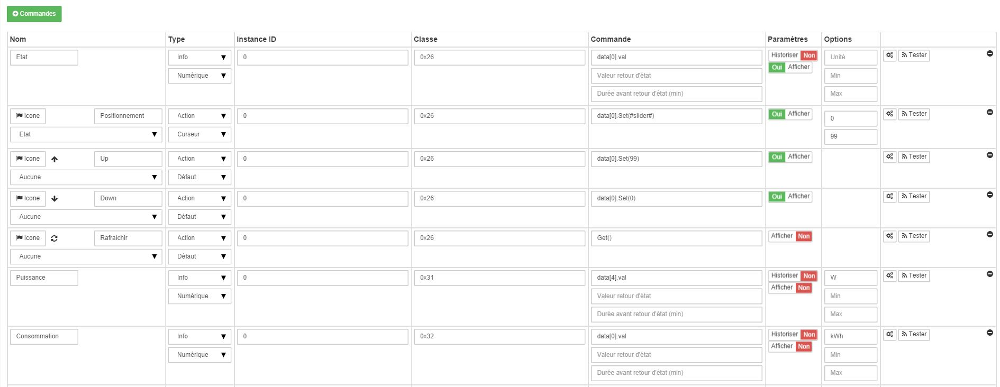

 "Persiana enrollable" 
===============================

\

-   **El módulo**

\

\

-   **El visual de Jeedom**

\

\

Resumen 
------

\

El micromódulo FGRM-222 le permitirá gestionar las motorizaciones de
persianas electrónicas, persianas o puertas venecianas
garaje gracias al protocolo Z-Wave manteniendo su
interruptor existente. Entonces podrá operar el motor
conectado usando el interruptor existente, un transmisor Z-Wave o
directamente desde el botón en el micromódulo.

Además, este micromódulo es capaz de transmitir el consumo.
potencia eléctrica instantánea (W) y acumulativa (KWh) del equipo
adjunto.

Se requiere un controlador Z-Wave (control remoto, dongle, etc.) para
integre este módulo en su red si ya tiene una red
existente.

Cada módulo Z-Wave funciona como un repetidor inalámbrico con el
otros módulos, para garantizar una cobertura total de su
vivienda.

Nota : Este módulo requiere neutral para operar.

\

Funciones 
---------

\

-   Controle sus persianas o persianas de forma remota

-   Compatible con BSO y persiana veneciana con posicionamiento de
    listones

-   Se instala detrás de un interruptor existente

-   Arriba / abajo y función de posicionamiento

-   Compatible con motores con parada mecánica o electrónica.

-   Medición del consumo instantáneo y acumulativo.

-   Actualización inalámbrica con la caja Fibaro Home Center 2

-   Función de prueba de cobertura de red Z-Wave

-   Pequeño, discreto y estético.

-   Facilidad de uso e instalación.

\

Características técnicas 
---------------------------

\

-   Tipo de módulo : Receptor Z-Wave

-   Suministro : 

-   El consumo de energía : &lt; 0,8W

-   Cableado : 3 hilos, neutro requerido

-   Carga máxima : 

-   Frecuencia : 868.42 Mhz

-   Fuerza de la señal : 

-   Distancia de transmisión : 50m de campo libre, 30m en interiores

-   Dimensiones: 

-   Temperatura de funcionamiento : 0-40 ° C

-   Temperatura límite : 105 ° C

-   Normas : LVD (2006/95 / EC), EMC (2004 / 10B / EC), R & TTE (1999/5 / EC)

\

Datos del módulo 
-----------------

\

-   Hacer : Grupo Fibar

-   Nombre : 

-   ID del fabricante : 271

-   Tipo de producto : 769

-   ID del producto : 4097

\

Configuración 
-------------

\

Para configurar el complemento OpenZwave y saber cómo poner Jeedom en
inclusión refiérase a esto
[Documentación](https://jeedom.fr/doc/Documentación/plugins/openzwave/es_ES/openzwave.html).

\

> **Importante**
>
> Para poner este módulo en modo de inclusión, presione el botón 3 veces
> botón de inclusión, de acuerdo con su documentación en papel.

\

\

Una vez incluido, deberías obtener esto :

\

\

### Comandos 

\

Una vez que el módulo ha sido reconocido, los comandos asociados con el módulo serán
disponible.

\

\

Aquí está la lista de comandos :

\

-   Estado : Es el comando que permite conocer la posición de
    tu obturador

-   Posicionamiento : Es el comando que hace posible definir el
    porcentaje de apertura

-   Arriba : Este es el comando que le permite abrir completamente el obturador

-   Abajo : Es el comando que cierra completamente el obturador.

-   Refrescar : Es el comando que permite volver a preguntar la posición.
    de la persiana

-   Potencia : Comando que permite tener el consumo del módulo

-   El consumo : Control que permite conocer el poder
    Instantáneo utilizado por el módulo

-   Detener : Control para detener el movimiento del obturador.

-   DETENER BSO : Comando para detener el movimiento (en modo
    listón ajustable)

-   Inclinación : Le permite inclinar las lamas (modo de lamas ajustable)

-   Declinar : Permite disminuir las lamas (modo de lamas ajustable)

-   No : Se usa para definir el paso para presionar Rechazar o
    Inclinación

\

### Configuracion del modulo 

\

Entonces, si desea configurar el módulo de acuerdo con
de su instalación, debe pasar por el botón
"Configuración "del complemento OpenZwave de Jeedom.

\

\

Llegará a esta página (después de hacer clic en la pestaña
configuraciones)

\

\

Detalles del parámetro :

\

-   1: permite bloquear el módulo (para congelar un obturador) (en el caso
    presionando un interruptor)

-   2: lo mismo pero para los comandos zwave

-   3: tipo de informes (clásico o fibroso)

-   10: modo de funcionamiento (persiana veneciana, obturador, etc.)

-   12: duración de un turno completo (en modo de persiana veneciana)

-   13: le permite elegir cuándo los listones deben volver a su
    puesto anterior

-   14: permite elegir el tipo de interruptor

-   17: permite elegir cuánto tiempo después del límite definido en 18
    el obturador se detiene

-   18: potencia de seguridad del motor

-   22: 

-   29: permite calibrar la aleta

-   30 a 35: permite definir el comportamiento del módulo
    diferentes alarmas zwave

-   40: Power Delta para desencadenar un aumento de la información (incluso en
    fuera del período definido en 42)

-   42: período de retroalimentación de información

-   43: delta de energía para desencadenar un ascenso de información (incluso en
    fuera del período definido en 42)

-   44: permite elegir si el consumo y la potencia
    debe tener en cuenta la del módulo en sí

-   50: permite elegir si el módulo debe enviar la información a los nodos
    en asociación en modo escena o en modo asociación

\

### Grupos 

\

Este módulo tiene 3 grupos de asociación, solo el tercero es
.

\

\

Bueno saber 
------------

\

### Restablecer 

\

\

Puede restablecer su medidor de consumo haciendo clic en
en este botón disponible en la pestaña Sistema.

\

### Importante 

\

> **Importante**
>
> Para que los comentarios de estado funcionen en Jeedom, es necesario
> forzar la calibración del equipo (parámetro 29 a "Sí") y la
> el posicionamiento debe estar activo (parámetro 10 con valores "Activo
> directo "," Veneciano activo "o" Puerta activa ").

\

### Visual alternativo 

\

\

Despertador 
------

\

No hay noción de activación en este módulo.

\

Faq. 
------

\

Lea la sección Restablecer de este documento.

\

**@sarakha63**
