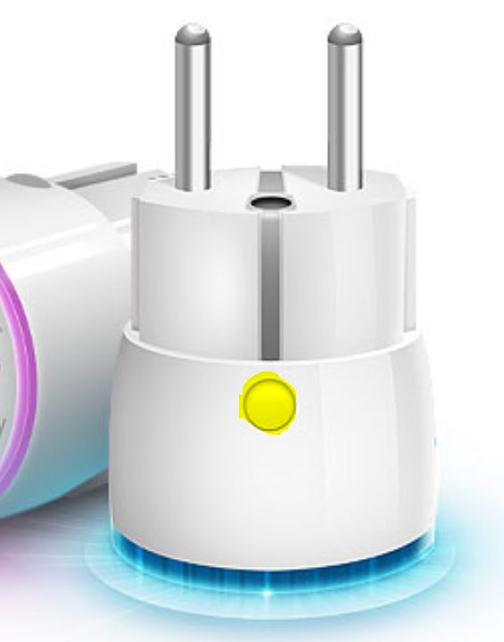
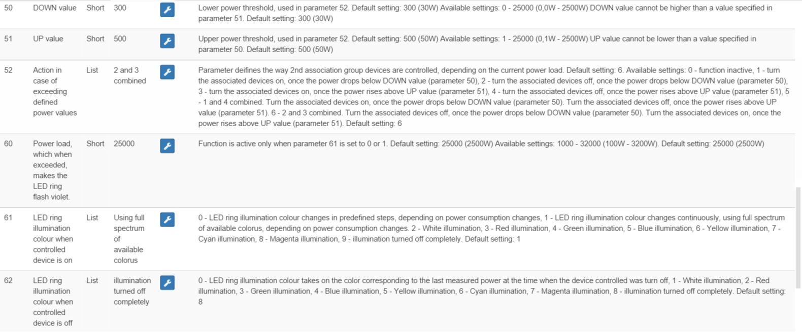

Fibaro FGRWPE-101 "Wall plug" 
=============================

 \

-   **El módulo**

 \

 \

-   **Le visuel Jeedom**

 \

 \

Resumen 
------

 \

Le Wall Plug Fibaro est un récepteur-prise-transmetteur universel sous
forme d\`un adaptateur à brancher sur une prise murale au réseau
électrique, compatible avec le standard Z-Wave. Il permet de gérer
n'importe quel dispositif ayant une puissance maximale de 2,5kW, tout en
intégrant la fonctionnalité de mesurer la puissance active du courant et
la consommation d'énergie des dispositifs. Ce module est équipé d\`un
anneau lumineux avec des LEDs signalant son état et la consommation
d'énergie de tout dispositif branché. Le Wall Plug Fibaro peut être
contrôlé par un bouton sur son carter ou bien depuis n'importe quel
contrôleur compatible avec le standard Z-Wave

 \

Funciones 
---------

 \

-   Contrôlé depuis un contrôleur compatible avec le standard Z-Wave.

-   Contrôle à micro-chips.

-   Élément d\`exécution: Relé.

-   Mesure de puissance active du courant et de l\`énergie électrique
    du récepteur.

 \

Caractéristiques techniques 
---------------------------

 \

-   Type de module : Récepteur Z-Wave

-   Alimentation : 230V, 50Hz

-   Consommation électrique : jusqu'à 0.8W

-   Charge maxi : 2.5kW

-   Fréquence : 868,42 Mhz EU

-   Distance de transmission : 50m champ libre, 30m en intérieur

-   Dimensions: 17 x 42 x 37 mm

-   Température de fonctionnement : 0-40°C

-   Température limite : 105°C

-   Normes : LVD (2006/95/WE), EMC (2004/108/EC), R&TTE(1999/5/WE)

 \

Données du module 
-----------------

 \

-   Marque : Fibar Group

-   Nombre : Wall Plug FGWPE-101

-   Fabricant ID : 271

-   Type Produit : 1536

-   Produit ID : 4096

 \

Configuración 
-------------

 \

Pour configurer le plugin OpenZwave et savoir comment mettre Jeedom en
inclusion référez-vous à cette
[documentation](https://jeedom.fr/doc/documentation/plugins/openzwave/fr_FR/openzwave.html).

 \

> **Importante**
>
> Pour mettre ce module en mode inclusion il faut appuyer 3 fois sur le
> bouton d'inclusion, conformément à sa documentation papier.

 \

 \

Une fois inclus vous devriez obtenir ceci :

 \

 \

### Comandos 

 \

Une fois le module reconnu, les commandes associées au module seront
disponible.

 \

 \

Voici la liste des commandes :

 \

-   Estado : C'est la commande qui permet de connaître le statut de la
    prise

-   Uno : C'est la commande qui permet d'allumer la prise

-   Apagado : C'est la commande qui permet d'éteindre la prise

-   Potencia : C'est la commande qui remonte la puissance instatanée
    consommée

-   Conso : C'est la commande qui remonte la consommation totale

 \

A noter que sur le dashboard les commandes ON/OFF/ETAT sont regroupées
en un seul bouton.

 \

### Configuracion del modulo 

 \

Ensuite si vous voulez effectuer la configuration du module en fonction
de votre installation, il faut pour cela passer par la bouton
"Configuración" du plugin OpenZwave de Jeedom.

 \

 \

Vous arriverez sur cette page (après avoir cliqué sur l'onglet
paramètres)

 \

 \

Détails des paramètres :

 \

-   1: permet de bloquer le module en toujours ON

-   16: permet de se souvenir du dernier état en cas de coupure de
    courant

-   34: permet de choisir a quel type d'alarme du réseau Zwave la prise
    doit réagir

-   35: permet de régler la façon dont la prise réagira aux alarmes

-   39: permet de définir la durée de l'alarme

-   40: permet de définir de combien doit varier la puissance pour être
    remontée (en %)

-   42: idem mais en mode standard (jusqu'à 5 fois par pas définis en
    param 43)

-   43: intervalle de remontée de la puissance

-   45: intervalle de remontée de la consommation (en kWh 10=0,1 kWh)

-   47: intervalle en secondes de remontée des infos independamment
    d'une variation

-   49: prendre en compte la consommation du module lui même dans les
    valeurs

-   50: valeur minimal utilisée par le param 52

-   51: valeur maximale utilisée par le param 52

-   52: action à faire si la puissance sort des bornes définies aux
    paramètres 50 et 51

-   60: puissance au dela de laquelle la prise clignotera en violet

-   61: couleur quand la prise est allumée

-   62: couleur quand la prise est éteinte

-   63: couleur lorsqu'une alarme Zwave est détectée

-   70: puissance de sécurité (la prise se coupera lorsque la puissance
    atteindra ce seuil)

 \

### Grupos 

 \

Ce module possède 3 groupes d'association, seul le troisième est
indispensable.

 \

 \

Bon à savoir 
------------

 \

### Reset 

 \

 \

Vous pouvez remettre à zéro votre compteur de consommation en cliquant
sur ce bouton disponible dans l'onglet Système. Il faut choisir
PressButton.

 \

### Visuel alternatif 

 \

 \

Wakeup 
------

 \

Pas de notion de wakeup sur ce module.

 \

F.A.Q. 
------

 \

Lire la section Reset de cette doc.

 \

**@sarakha63**
