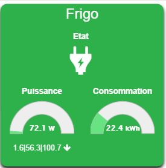

" 
=============================

\

-   **El módulo**

\

\

-   **El visual de Jeedom**

\

\

Resumen 
------

\

. 

. 

. 

\

Funciones 
---------

\

-   .

-   .

-   : Relé.

-   
    .

\

Características técnicas 
---------------------------

\

-   Tipo de módulo : Receptor Z-Wave

-   Suministro : 

-   El consumo de energía : 

-   Carga máxima : 

-   Frecuencia : 

-   Distancia de transmisión : 50m de campo libre, 30m en interiores

-   Dimensiones: 17 x 42 x 37 mm

-   Temperatura de funcionamiento : 0-40 ° C

-   Temperatura límite : 105 ° C

-   Normas : 

\

Datos del módulo 
-----------------

\

-   Hacer : Grupo Fibar

-   Nombre : 

-   ID del fabricante : 271

-   Tipo de producto : 1536

-   ID del producto : 4096

\

Configuración 
-------------

\

Para configurar el complemento OpenZwave y saber cómo poner Jeedom en
inclusión refiérase a esto
[documentation](https://jeedom.fr/doc/documentation/plugins/openzwave/es_ES/openzwave.html).

\

> **Importante**
>
> Para poner este módulo en modo de inclusión, presione el botón 3 veces
> botón de inclusión, de acuerdo con su documentación en papel.

\

\

Una vez incluido, deberías obtener esto :

\

\

### Comandos 

\

Una vez que el módulo ha sido reconocido, los comandos asociados con el módulo serán
disponible.

\

\

Aquí está la lista de comandos :

\

-   Estado : Es el comando que permite conocer el estado de la
    Salida

-   Uno : Este es el comando que enciende la salida

-   Apagado : Es el comando que hace posible extinguir la captura.

-   Potencia : 
    consumido

-   El consumo : Es el orden que informa el consumo total.

\

Tenga en cuenta que en el tablero los comandos ON / OFF / STATUS están agrupados
en un botón.

\

### Configuracion del modulo 

\

Entonces, si desea configurar el módulo de acuerdo con
de su instalación, debe pasar por el botón
"Configuración "del complemento OpenZwave de Jeedom.

\

\

Llegará a esta página (después de hacer clic en la pestaña
configuraciones)

\

\

Detalles del parámetro :

\

-   1: 

-   16: 
    

-   34: 
    

-   35: 

-   39: 

-   40: 
    

-   42: 
    

-   43: 

-   45: 

-   47: 
    

-   49: 
    Valores

-   50: 

-   51: 

-   52: 
    

-   60: 

-   61: 

-   62: 

-   63: 

-   70: 
    

\

### Grupos 

\

Este módulo tiene 3 grupos de asociación, solo el tercero es
indispensable.

\

\

Bueno saber 
------------

\

### Restablecer 

\

\

Puede restablecer su medidor de consumo haciendo clic en
en este botón disponible en la pestaña Sistema. Hay que elegir
PressButton.

\

### Visual alternativo 

\

\

Despertador 
------

\

No hay noción de activación en este módulo.

\

Faq. 
------

\

Lea la sección Restablecer de este documento.

\

**@sarakha63**
