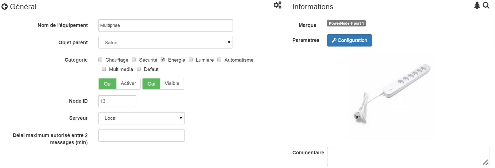
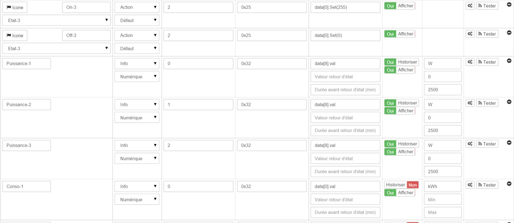

Greenwave PowerNode - 6 prises 
==============================

 \

-   **Le module**

 \

 \

-   **Le visuel Jeedom**

 \

 \

Résumé 
------

 \

La multiprise PowerNode de GreenWave est un appareil intelligent qui se
connecte à vos appareils électroménagers et électroniques pour vous
permettre de surveiller et contrôler la consommation électrique de vos
appareils à distance via un navigateur Web ou un smartphone. Utilisant
la technologie Z-Wave, la multiprise PowerNode est compatible avec la
plupart des box domotiques du marché comme Fibaro Home Center 2, eedomus
ou Zipabox. Equipée de 6 ports, elle pourra contrôler indépendamment 6
appareils électriques différents d'une puissance totale de 10A.

La multiprise PowerNode recueille des données sur la consommation
d'énergie des appareils connectés et les transmet à la box domotique.
Vous pouvez alors contrôler la consommation d'énergie de chaque appareil
connecté. Cette multiprise vous permet également d'activer ou désactiver
des périphériques à distance via un navigateur Web ou smartphone ou de
définir un calendrier pour activer ou désactiver automatiquement vos
appareils à des heures prédéfinies. Une petite molette sur le côté de la
multiprise permet de choisir une couleur qui représentera la pièce à
laquelle est affectée la multiprise. Par exemple " bleu pour la chambre
". Cette astuce vous permettra de différencier vos différentes
multiprises PowerNode. On peut également régler cette molette sur un
cadenas. Cette fonction permet de verrouiller la multiprise afin
d'éviter de l'éteindre par accident, mais le contrôle depuis la box
domotique ne sera plus possible.

La multiprise PowerNode dispose aussi d'un indicateur d'état lumineux
qui donne différentes informations en fonction de sa couleur : prises
allumées ou éteintes, portée radio limitée, mode inclusion et exclusion.

La multiprise PowerNode est équipée d'une protection contre les
surintensités pour protéger les appareils connectés. La PowerNode
désactivera les ports en cas du dysfonctionnement d'un appareil
défectueux ou d'un court-circuit. Une protection supplémentaire est
assurée par le fusible interne situé dans la multiprise.

Cette multiprise est idéale pour contrôler des appareils multimédia dans
un meuble de télévision ou pour piloter du matériel informatique situé
dans un bureau et ainsi éviter d'avoir à utiliser 6 prises Z-Wave
individuelles.  \

Fonctions 
---------

 \

-   Multiprise Z-Wave 6 ports

-   Permet le suivi des consommations des appareils branchés

-   Fonction ON/OFF

-   Possibilité de lui affecter un numéro et une couleur afin de
    différencier les différentes PowerNode d'une même installation.

-   Bouton On/Off directement sur la multiprise

-   Protection contre les surintensités

-   Indicateur d'état lumineux

 \

Caractéristiques techniques 
---------------------------

 \

-   Alimentation : 250V \~ AC, 50Hz

-   Courant de charge maximum : 10A

-   Puissance de charge maximale : 2400W (@ 240V)

-   Consommation en veille : 0,4 W

-   Précision de mesure : ± 0.1W

-   Protection contre les surintensités : 10A fusible interne

-   Type de prise : DIN49440 / CEE 7/7 (Schuko)

-   Radio Fréquence Z-Wave : 868.42MHz

-   Portée maximale Z-Wave : 30m

-   Température de fonctionnement : 0 ° C à + 25 ° C

-   Température de stockage : -20 ° C à + 60 ° C

-   Humidité maximale : 5% à 90%

-   Classe IP (Tolérance d'humidité) : IP20

 \

Données du module 
-----------------

 \

-   Marque : GreenWave

-   Nom : GreenWave\[6 x prises\]

-   Fabricant ID : 153

-   Type Produit : 3

-   Produit ID : 4

 \

Configuration 
-------------

 \

Pour configurer le plugin OpenZwave et savoir comment mettre Jeedom en
inclusion référez-vous à cette
[documentation](https://jeedom.fr/doc/documentation/plugins/openzwave/fr_FR/openzwave.html).

 \

> **Important**
>
> Pour mettre ce module en mode inclusion il faut appuyer sur le bouton
> inclusion présent sur la prise.

 \

 \

Une fois inclus vous devriez obtenir ceci :

 \

 \

### Commandes 

 \

Une fois le module reconnu, les commandes associées au module seront
disponibles.

 \

 \

Voici la liste des commandes :

 \

-   Etat-1 : C'est la commande qui permet de connaître le statut de la
    prise 1

-   On-1 : C'est la commande qui permet d'allumer la prise 1

-   Off-1 : C'est la commande qui permet d'éteindre la prise 1

-   Puissance-1 : C'est la commande qui remonte la puissance instatanée
    consommée de la prise 1

-   Conso-1 : C'est la commande qui remonte la consommation totale de la
    prise 1

-   Etat-2 : C'est la commande qui permet de connaître le statut de la
    prise 2

-   On-2 : C'est la commande qui permet d'allumer la prise 2

-   Off-2 : C'est la commande qui permet d'éteindre la prise 2

-   Puissance-2 : C'est la commande qui remonte la puissance instatanée
    consommée de la prise 2

-   Conso-2 : C'est la commande qui remonte la consommation totale de la
    prise 2

-   Etat-3 : C'est la commande qui permet de connaître le statut de la
    prise 3

-   On-3 : C'est la commande qui permet d'allumer la prise 3

-   Off-3 : C'est la commande qui permet d'éteindre la prise 3

-   Puissance-3 : C'est la commande qui remonte la puissance instatanée
    consommée de la prise 3

-   Conso-3 : C'est la commande qui remonte la consommation totale de la
    prise 3

-   Etat-4 : C'est la commande qui permet de connaître le statut de la
    prise 4

-   On-4 : C'est la commande qui permet d'allumer la prise 4

-   Off-4 : C'est la commande qui permet d'éteindre la prise 4

-   Puissance-4 : C'est la commande qui remonte la puissance instatanée
    consommée de la prise 4

-   Conso-4 : C'est la commande qui remonte la consommation totale de la
    prise 4

-   Etat-5 : C'est la commande qui permet de connaître le statut de la
    prise 5

-   On-5 : C'est la commande qui permet d'allumer la prise 5

-   Off-5 : C'est la commande qui permet d'éteindre la prise 5

-   Puissance-5 : C'est la commande qui remonte la puissance instatanée
    consommée de la prise 5

-   Conso-5 : C'est la commande qui remonte la consommation totale de la
    prise 5

-   Etat-6 : C'est la commande qui permet de connaître le statut de la
    prise 6

-   On-6 : C'est la commande qui permet d'allumer la prise 6

-   Off-6 : C'est la commande qui permet d'éteindre la prise 6

-   Puissance-6 : C'est la commande qui remonte la puissance instatanée
    consommée de la prise 6

-   Conso-6 : C'est la commande qui remonte la consommation totale de la
    prise 6

 \

A noter que sur le dashboard les commandes ON/OFF/ETAT sont regroupées
en un seul bouton.

 \

### Configuration du module 

 \

Vous pouvez effectuer la configuration du module en fonction de votre
installation. Il faut pour cela passer par le bouton "Configuration" du
plugin OpenZwave de Jeedom.

 \

 \

Vous arriverez sur cette page (après avoir cliqué sur l'onglet
Paramètres)

 \

 \

Comme vous pourrez le constater il n'y a pas beaucoup de configuration
pour ce module.

 \

Détails des paramètres :

 \

-   1 : Délais avant le clignotement du bouton : nombres de secondes
    minimum entre deux communications (si ce délai est dépassé le bouton
    de la prise clignotera)

-   2 : Couleur selectionnée de la molette (détectée automatiquement)

 \

### Groupes 

 \

Ce module possède quatre groupes d'association, seul le 1er groupe est
indispensable.

 \

 \

Bon à savoir 
------------

 \

### Spécificités / Polling 

 \

Contrairement à sa petite soeur "Une prise", cette multiprise nécessite
un polling pour remonter la consommation.

 \

 \

Il est juste nécessaire de l'activer pour la commande Power de chaque
prise. Cela aura pour effet de remonter les deux (conso et puissance)

 \

### Consommation Globale 

 \

 \

Vous pouvez à l'aide d'un virtuel vous créer un cumul de consommation
des 6 prises.

 \

 \

### Reset 

 \

 \

Vous pouvez remettre à zéro votre compteur de consommation en cliquant
sur ce bouton disponible dans l'onglet Système. (Il y a un reset par
prise). Il faut choisir PressButton.

 \

Wakeup 
------

 \

Pas de notion de wakeup sur ce module.

 \

F.A.Q. 
------

 \

Avez vous réglé un CRON.

 \

Non. Le module ne le permet pas. Mettez un morceau de ruban adhésif noir
dessus.

 \
**@sarakha63**
