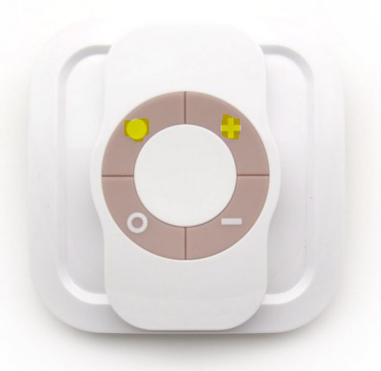

# Mediodía Télécommande - Octan

**El módulo**

**El visual de Jeedom**

## Resumen

El Octan Remote NodOn® le permite controlar cualquier receptor compatible con Z-Wave® o Z-Wave Plus®, como la toma de control remoto NodOn® (modo de controlador principal - Independiente), o incluso activar escenas / acciones a través de un sistema de automatización del hogar compatible (modo de puerta de enlace)

Su imán integrado permite fijarlo en todas partes, desde el radiador hasta la puerta del refrigerador, a través de su soporte de pared. Entre el control remoto y el interruptor, el control remoto Octan revoluciona el control de los objetos domésticos

## Funciones

-   Control solo o con un sistema domótico
-   Imán integrado
-   Led de color
-   Placa de pared
-   2 años de batería

## Características técnicas

-   Suministro : Batería CR2032 - Autonomía 1,5 - 2 años
-   4 botones
-   Soporte de pared fijado con adhesivo de doble cara (incluido) o tornillos (no incluidos)
-   Imán integrado para fijación a superficie metálica
-   Temperatura de funcionamiento : 0 ° C a 40 ° C - Altitud : 2000m
-   Protocolo de radio Z-Wave® : 868.4MHz - Serie 500 - Compatible con SDK Z-Wave Plus® 06.51.01 Alcance: 40m interior / 80m exterior
-   Dimensiones : 80 \*80 \*15mm
-   2 años de garantia

## Datos del módulo

-   Hacer : Nodon
-   Nombre : CRC-3-1-00 Octan Remote
-   ID del fabricante : 357
-   Tipo de producto : 2
-   ID del producto : 1

## Configuración

Para configurar el complemento OpenZwave y saber cómo incluir a Jeedom, consulte esto [Documentación](https://doc.jeedom.com/es_ES/plugins/automation%20protocol/openzwave/).

> **Importante**
>
> Para poner este módulo en modo de inclusión, presione los dos botones (1 y 2) hasta que la luz se vuelva rosa, luego presione el botón 1, de acuerdo con su documentación en papel.

Una vez incluido, deberías obtener esto :

### Comandos

Una vez que se reconoce el módulo, los comandos asociados con el módulo estarán disponibles.

Aquí está la lista de comandos :

-   Botones : es el comando que empujará el botón hacia arriba

+ ---------------- + ---------------- + --------------- - + ---------------- + ---------------- +
| Botones        | Apoyo          | Pulsación larga     | Relajamiento    | Doble soporte   |
+ ================ + ================ + ================ = + ================ + ================= +
| **1**          | 10             | 12             | 11             | 13             |
+ ---------------- + ---------------- + --------------- - + ---------------- + ---------------- +
| **2**          | 20             | 22             | 21             | 23             |
+ ---------------- + ---------------- + --------------- - + ---------------- + ---------------- +
| **3**          | 30             | 32             | 31             | 33             |
+ ---------------- + ---------------- + --------------- - + ---------------- + ---------------- +
| **4**          | 40             | 42             | 41             | 43             |
+ ---------------- + ---------------- + --------------- - + ---------------- + ---------------- +

### Configuración du module

> **Importante**
>
> Durante una primera inclusión, siempre active el módulo justo después de la inclusión.

Luego, si desea configurar el módulo de acuerdo con su instalación, debe pasar por el botón "Configuración" del complemento OpenZwave de Jeedom.

Llegará a esta página (después de hacer clic en la pestaña Configuración)

Detalles del parámetro :

-   1-2 : Le permite elegir los perfiles de los botones cuando se usa centralmente (inútil para usar en Jeedom)
-   3 : Parámetro importante para decir si el interruptor debe funcionar en el modo Escena o Escena central (escena configurada absolutamente)
-   4-7 : Elija el modo de operación del botón (en caso de asociaciones de grupo)
-   8 : Le permite elegir el modo de funcionamiento del LED

### Grupos

Este módulo tiene 7 grupos de asociación.

-   Grupo 1 - Línea de vida : Este grupo se usa generalmente para informar información del Smart Plug al controlador de red principal.
-   Grupo 2 a 5: los dispositivos de estos grupos se controlan mediante el botón correspondiente según el perfil MONO
-   Grupo 6 a 7: los dispositivos de estos grupos se controlan mediante el botón correspondiente según el perfil DUO

> **Importante**
>
> Al menos Jeedom debería terminar en el grupo 1

## Bueno saber

### Específicos

-   Este módulo puede ser complicado en la inclusión. No dude en despertarlo 1 o 2 veces después de la inclusión, y verifique cuidadosamente el grupo de asociación.

## Despertador

Para activar este módulo, solo presione uno de los botones

## Nota importante

> **Importante**
>
> Tienes que despertar el módulo : después de su inclusión, después de un cambio en la configuración, después de un cambio en la activación, después de un cambio en los grupos de asociación
