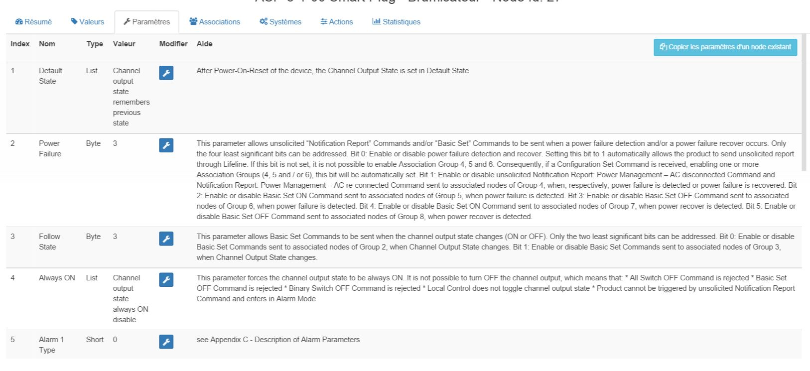

# Enchufe inteligente Nodon - Smartplug

**El módulo**

**El visual de Jeedom**

## Resumen

El enchufe con control remoto NodOn® se puede controlar a través de un sistema de automatización del hogar compatible con Z-Wave® o Z-Wave Plus® o directamente a través de otros controladores Z-Wave® o Z-Wave Plus® como el control remoto suave, el interruptor de pared o el Octan Remote NodOn®. Estándar alemán (Schuko) o francés (Tipo E), el enchufe se puede conectar en ambas direcciones, cabeza arriba o cabeza abajo. Asociadas con su diseño fino, estas 2 características permiten una integración más fácil, sin obstruir los barriles vecinos en una regleta. Aprender el zócalo con su controlador requiere solo unos segundos. Un botón local le permite encender o apagar el enchufe directamente.

## Fonctions

-   Detección de pérdida de corriente de línea
-   Ergonomique: Posibilidad de enchufar el enchufe cabeza arriba / cabeza abajo
-   Gestión inteligente de alarmas
-   Alcance de radio mejorado
-   Amperaje máximo: 16A

## Características técnicas

-   Suministro : 230V AC +/- 10% - 50Hz
-   Potencia máxima : 3000 W continuo / 3500 W cíclico (carga resistiva) Consumo intrínseco : &lt;1W
-   Temperatura de funcionamiento : 0 ° C a 40 ° C - Altitud : 2000m
-   Protocolo de radio Z-Wave® : 868.4MHz - Serie 500 - Compatible con SDK Z-Wave Plus® 06.51.01
-   Alcance: 40m interior / 80m exterior
-   Dimensions: 104 \*51 \*36mm
-   2 años de garantia
-   Tipo de la UE

## Datos del módulo

-   Hacer : Nodon
-   Nombre : Smartplug
-   ID del fabricante : 357
-   Tipo de producto : 1
-   ID del producto : 1

## Configuration

Para configurar el complemento OpenZwave y saber cómo incluir a Jeedom, consulte esto [Documentación](https://doc.jeedom.com/es_ES/plugins/automation%20protocol/openzwave/).

> **Importante**
>
> Para poner este módulo en modo de inclusión, presione el botón hasta que la luz se vuelva roja, de acuerdo con su documentación en papel.

Una vez incluido, deberías obtener esto :

### Commandes

Una vez que se reconoce el módulo, los comandos asociados con el módulo estarán disponibles.

Aquí está la lista de comandos :

-   Estado : Es el comando que permite conocer el estado del zócalo (activar / desactivar)
-   Uno : Este es el comando que enciende la salida
-   Apagado : Es el comando que hace posible extinguir la captura
-   Estado : Se usa para averiguar si el tomacorriente está alimentado o no (corte de energía / detección de desconexión)

Tenga en cuenta que en el tablero de instrumentos, la información de estado, ON / OFF se encuentra en el mismo icono.

### Configuracion del modulo

Puede configurar el módulo de acuerdo con su instalación. Para hacer esto, vaya al botón "Configuración" del complemento Zwave de Jeedom.

Llegará a esta página (después de hacer clic en la pestaña Configuración)

Detalles del parámetro :

-   1 : Este parámetro define el estado (ENCENDIDO / APAGADO) del Smart Plug después de una falla de energía o después de la conexión
-   2 : Este parámetro configura los informes de corte de energía / notificación de retorno, así como los grupos asociados (Grupos 4, 5, 6, 7, 8). Son posibles varias combinaciones (consulte la documentación en papel o la burbuja de ayuda en jeedom). Se recomienda establecer este parámetro en 1.
-   3 : Este parámetro permite activar o desactivar los grupos 2 y 3.
-   4 : Le paramètre force l'état de la Smart Plug à « ON » (Smart Plug activée). Cuando el parámetro está activado, no es posible apagar el Smart Plug (local o radio)
-   Parámetros 5 a 20 : Mediante parámetros de configuración \#5 à \#20, es posible configurar hasta 8 alarmas diferentes. Para configurar correctamente sus alarmas, el formulario en línea: www.nodon.es / support / asp3 / alarm lo guiará

### Groupes

Este módulo tiene 8 grupos de asociación.

-   Grupo 1 - Línea de vida : Este grupo se usa generalmente para informar información del Smart Plug al controlador de red principal.
-   Grupo 2: monitoreo del estado de Smart Plug Cuando el Smart Plug se activa (respectivamente, se desactiva) mediante el botón local, envía un comando de activación (respectivamente desactivación) a los dispositivos asociados. No se envía ningún comando si el cambio de estado del Smart Plug fue causado por un comando de radio
-   Grupo 3 - Monitoreo de estado adicional Cuando el Smart Plug se activa (desactiva respectivamente) a través del botón local, envía un comando de desactivación (activación respectivamente) a los dispositivos asociados. No se envía ningún comando si el cambio de estado del Smart Plug fue causado por un comando de radio.
-   Grupo 4: Notificación de falla de energía Cuando el Smart Plug detecta una falla de energía o un retorno de energía, se envía un informe de notificación a los dispositivos asociados. Le rapport envoyé est un « Notification Report : Administración de energía: CA desconectada / reconectada).
-   Grupo 5: activación en caso de falla de energía Cuando el Smart Plug detecta una falla de energía, activa los dispositivos asociados.
-   Grupo 6: desactivación en caso de fallo de alimentación Cuando el Smart Plug detecta un fallo de alimentación, desactiva los dispositivos asociados
-   Grupo 7 - Activación en el retorno actual Cuando el Smart Plug detecta un retorno actual, activa los dispositivos asociados.
-   Grupo 8 - Desactivación al retorno de corriente Cuando el Smart Plug detecta un retorno de corriente, desactiva los dispositivos asociados

> **Importante**
>
> Como mínimo, Jeedom debe encontrarse en los grupos 1 y 4

## Bueno saber

### Específicos

-   Es inútil divertirse conectando / desconectando el enchufe para observar la alarma. Esto solo funcionará unas 3 veces. Más allá del enchufe debe permanecer encendido durante un tiempo para recargar la batería interna.

## Wakeup

No hay noción de activación en este módulo.
