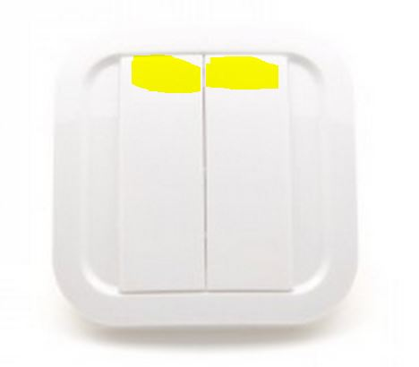

# Nodon Switch - Interruptor de pared

**El módulo**

**El visual de Jeedom**

Resumen
------

El interruptor de pared NodOn® puede controlar directamente cualquier dispositivo compatible con Z-Wave® o Z-Wave Plus®, como el enchufe inteligente NodOn® o incluso disparar escenas a través de un sistema de automatización del hogar compatible.

El interruptor tiene una placa de montaje para facilitar el montaje en la casa: usando los tornillos de una olla de montaje, atornillándolo a la pared o simplemente pegándolo a través de los adhesivos de doble cara presentes en la parte posterior de la placa.

Fonctions
---------

-   Control solo o con un sistema domótico
-   Fácil de montar y desmontar
-   Agradable sentimiento de apoyo
-   Sin hilos
-   2 años de batería

Características técnicas
---------------------------

-   Suministro : Batería CR2032 - Autonomía 1,5 - 2 años
-   4 botones
-   Montaje en pared mediante adhesivo de doble cara (incluido) o tornillos (no incluidos)
-   Temperatura de funcionamiento : 0 ° C a 40 ° C
-   Altitud : 2000m
-   Protocolo de radio Z-Wave® : 868.4MHz - Serie 500 - Compatible con Z-Wave Plus® SDK 06.51.06
-   Alcance : 40m en interiores / 70m en exteriores
-   Dimensiones : 80 \*80 \*15mm
-   2 años de garantia
-   EN 60950-1:2006 + A11:2009 + A1:2010 + A12:2011 + A2:2013
-   EN 300220-2 V2.4.1
-   EN301 489-1 V1.9.2
-   EN301 489-3 V1.6.1
-   EN 62479:2010

Datos del módulo
-----------------

-   Hacer : Nodon
-   Nombre : CWS-3-1-01 Interruptor de pared
-   ID del fabricante : 357
-   Tipo de producto : 2
-   ID del producto : 3

Configuration
-------------

Para configurar el complemento OpenZwave y saber cómo incluir a Jeedom, consulte esto [Documentación](https://doc.jeedom.com/es_ES/plugins/automation%20protocol/openzwave/).

> **Importante**
>
> Para poner este módulo en modo de inclusión, presione los dos botones (1 y 2) hasta que la luz se vuelva rosa, luego presione el botón 1, de acuerdo con su documentación en papel.

Una vez incluido, deberías obtener esto :

### Commandes

Una vez que se reconoce el módulo, los comandos asociados con los módulos estarán disponibles.

Aquí está la lista de comandos :

-   Botones : es el comando que empujará el botón hacia arriba

+ ---------------- + ---------------- + --------------- - + ---------------- + ---------------- +
| Botones        | Apoyo          | Pulsación larga     | Relajamiento    | Doble soporte   |
+ ================ + ================ + ================ = + ================ + ================= +
| **1**          | 10             | 12             | 11             | 13             |
+ ---------------- + ---------------- + --------------- - + ---------------- + ---------------- +
| **2**          | 20             | 22             | 21             | 23             |
+ ---------------- + ---------------- + --------------- - + ---------------- + ---------------- +
| **3**          | 30             | 32             | 31             | 33             |
+ ---------------- + ---------------- + --------------- - + ---------------- + ---------------- +
| **4**          | 40             | 42             | 41             | 43             |
+ ---------------- + ---------------- + --------------- - + ---------------- + ---------------- +

### Configuracion del modulo

> **Importante**
>
> Durante una primera inclusión, siempre active el módulo justo después de la inclusión.

Luego, si desea configurar el módulo de acuerdo con su instalación, debe pasar por el botón "Configuración" del complemento OpenZwave de Jeedom.

Llegará a esta página (después de hacer clic en la pestaña Configuración)

Detalles del parámetro :

-   1-2 : Le permite elegir el perfil de los botones cuando se usa centralmente (inútil para usar en Jeedom)
-   3 : Parámetro importante para decir si el interruptor debe funcionar en el modo Escena o Escena central (escena configurada absolutamente)
-   4-7 : Elija el modo de operación del botón (en caso de asociaciones de grupo)
-   8 : Le permite elegir el modo de funcionamiento del LED

### Groupes

Este módulo tiene 7 grupos de asociación.

-   Grupo 1 - Línea de vida : Este grupo se usa generalmente para informar información del Smart Plug al controlador de red principal.
-   Grupo 2 a 5: los dispositivos de estos grupos se controlan mediante el botón correspondiente según el perfil MONO
-   Grupo 6 a 7: los dispositivos de estos grupos se controlan mediante el botón correspondiente según el perfil DUO

> **Importante**
>
> Al menos Jeedom debería terminar en el grupo 1

Bueno saber
------------

### Específicos

-   Este módulo puede ser complicado en la inclusión. No dudes en despertarlo 1 o 2 veces después de la inclusión. Bueno revisa el grupo de asociación.

Wakeup
------

Para activar este módulo, simplemente presione uno de estos botones

Nota importante
---------------

> **Importante**
>
> Tienes que despertar el módulo : después de su inclusión, después de un cambio en la configuración, después de un cambio en la activación, después de un cambio en los grupos de asociación
