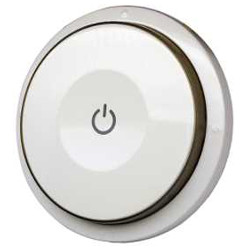

Botón de color inteligente Philio 
=========================

\

-   **El módulo**

\

\

-   **El visual de Jeedom**

\

\

Resumen 
------

\

Este interruptor de diseño único ofrece varias funciones. Vosotras
puede usarlo para encender, apagar o atenuar la iluminación, ajustar
la posición de sus persianas, ajuste la temperatura del termostato o
úsalo como temporizador.

Una vez incluido en su red Z-Wave, el conmutador Philio PSR04
debe estar asociado con los dispositivos que desea controlar.
Solo puede operar por asociación directa con
dispositivos, y no puede iniciar escenas creadas en su controlador
Automatización del hogar Z-Wave.

Utilizado como una unidad, tiene el mismo comportamiento que una unidad
tradicional Gire la perilla hacia la derecha para aumentar el
luz, y a la izquierda para disminuirlo.

Además, puede mover y colocar fácilmente este interruptor
en el lugar que elija gracias a su soporte magnético. Su concepción
resistente al agua permite su instalación en un lugar con alta humedad como
sala de baño.

Utiliza el último chip de la serie Z-Wave 500, proporcionando un aumento
50% de alcance de radio y 250% de velocidad de comunicación más rápida
rápido en comparación con los productos Z-Wave anteriores, así como un plus
bajo consumo de energía que permite una mayor autonomía.

\

Las funciones 
---------

\

-   Interruptor multifuncional

-   Tecnología Z-Wave +

-   Función de encendido / apagado y atenuación (iluminación o persianas)

-   Función de temporizador integrado

-   Etanche

-   Se adapta a cualquier estilo de decoración.

-   Batería recargable

-   

-   

-   

-   

-   Fácil de instalar

\

Características técnicas 
---------------------------

\

-   Comida : .
    la batería : 

-   Consumo en espera : 18µA

-    : 45mA

-   Frecuencia : 868.42 MHz

-   Distancia de transmisión : 

-   Dimensiones :

 :  : 
 : 
 :

\

Datos del módulo 
-----------------

\

-   Hacer : Philio

-   Apellido : Botón de color inteligente PSR04

-   ID del fabricante : 316

-   Tipo de producto : 9

-   ID del producto : 34

\

Configuracion 
-------------

\

Para configurar el complemento OpenZwave y saber cómo poner Jeedom en
inclusión refiérase a esto
[documentación](https://jeedom.fr/doc/documentation/plugins/openzwave/es_ES/openzwave.html).

\

> **Important**
>
> 
> 
> documentación en papel.

\

\

Una vez incluido, deberías obtener esto :

\

\

### Órdenes 

\

Una vez que el módulo ha sido reconocido, los comandos asociados con el módulo serán
disponibles.

\

\

Aquí está la lista de comandos :

\

-   Estado : 
    

-   Batería : 
    module

\

### Configuracion del modulo 

\

> **Important**
>
> Durante una primera inclusión, siempre active el módulo justo después
> inclusión.

\

Entonces, si desea configurar el módulo de acuerdo con
de su instalación, debe pasar por el botón
"Configuración "del complemento OpenZwave de Jeedom.

\

\

Llegará a esta página (después de hacer clic en la pestaña
configuraciones)

\

\

Detalles del parámetro :

\

-   1: 

-   2 : 

-   10 : 

-   25 : 
    
    

-   26 : 
    

\

### Grupos 

\

Este módulo tiene dos grupos de asociación, el primero es el único.

\

\

Bueno saber 
------------

\

### Específicos 

Para usar este módulo como control remoto, proceda de la siguiente manera :

-   

. 

Despertador 
------

\

Para activar este módulo, solo hay una forma :

-   

\

Faq. 
------

\

\

Este módulo es un módulo de batería, la nueva configuración no será
.

\

Nota importante 
---------------

\

> **Important**
>
> Tienes que despertar el módulo : después de su inclusión, después de un cambio
> de la configuración, después de un cambio de activación, después de un
> cambio de grupos de asociación

\

**@sarakha63**
