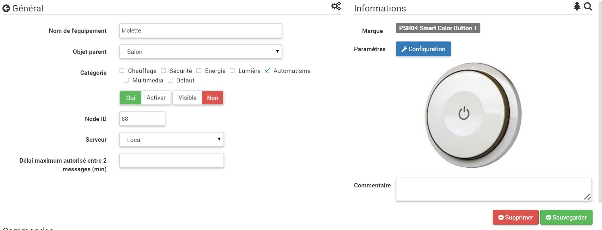

 
=========================

\

-   **El módulo**

\

\

-   **El visual de Jeedom**

\

\

Resumen 
------

\

.

.

.

.

. 

.

.

\

Funciones 
---------

\

-   

-   

-   

-   

-   

-   

-   

-   

-   

-   

-   

-   

\

Características técnicas 
---------------------------

\

-   Suministro : .
     : 

-   Consumo en espera : 

-    : 

-   Frecuencia : 868.42 MHz

-   Distancia de transmisión : 

-   Dimensiones :

Apoyo :  : 
 : 
 :

\

Datos del módulo 
-----------------

\

-   Hacer : 

-   Nombre : 

-   ID del fabricante : 316

-   Tipo de producto : 9

-   ID del producto : 34

\

Configuración 
-------------

\

Para configurar el complemento OpenZwave y saber cómo poner Jeedom en
inclusión refiérase a esto
[documentation](https://jeedom.fr/doc/documentation/plugins/openzwave/es_ES/openzwave.html).

\

> **Importante**
>
> 
> 
> documentación en papel.

\

\

Una vez incluido, deberías obtener esto :

\

\

### Comandos 

\

Una vez que el módulo ha sido reconocido, los comandos asociados con el módulo serán
disponible.

\

\

Aquí está la lista de comandos :

\

-   Estado : 
    

-   Batería : 
    Modulo

\

### Configuracion del modulo 

\

> **Importante**
>
> Durante una primera inclusión, siempre active el módulo justo después
> inclusión.

\

Entonces, si desea configurar el módulo de acuerdo con
de su instalación, debe pasar por el botón
"Configuración "del complemento OpenZwave de Jeedom.

\

\

Llegará a esta página (después de hacer clic en la pestaña
configuraciones)

\

\

Detalles del parámetro :

\

-   1: 

-   2 : 

-   10 : 

-   25 : 
    
    

-   26 : 
    

\

### Grupos 

\

\

\

Bueno saber 
------------

\

### Específicos 

 :

-   

. 

Despertador 
------

\

Para activar este módulo, solo hay una forma :

-   

\

Faq. 
------

\

\

Este módulo es un módulo de batería, la nueva configuración no será
.

\

Nota importante 
---------------

\

> **Importante**
>
> Tienes que despertar el módulo : después de su inclusión, después de un cambio
> de la configuración, después de un cambio de activación, después de un
> cambio de grupos de asociación

\

**@sarakha63**
