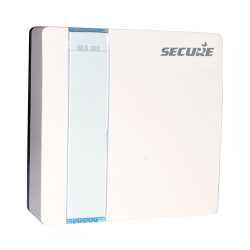
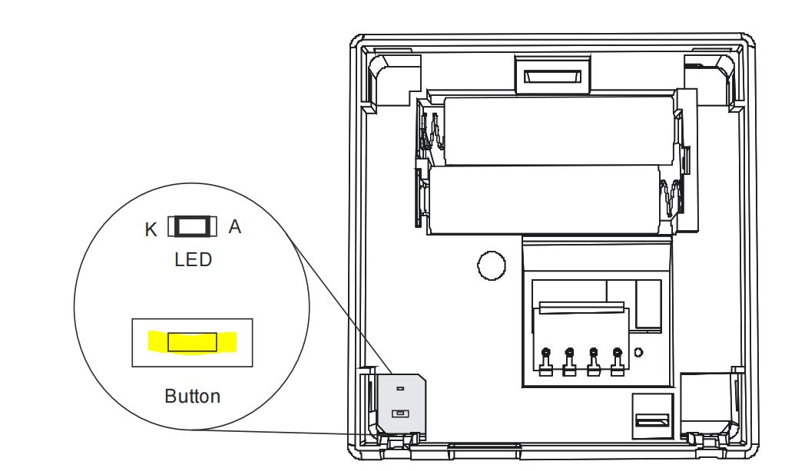
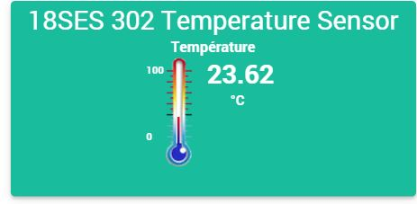

Asegure la temperatura SES 302 "" 
============================

\

-   **El módulo**

\

\

-   **El visual de la libertad**

\

\

Resumen 
------

\

La sonda SES302 permite medir la temperatura ambiente
interior Está alimentado por 2 baterías AA y tiene certificación Z-Wave
Más. Además de su función principal, es posible cablear
varias sondas externas seguras en el módulo, es decir:

-   Un sensor de temperatura externo NTC (SES001)

-   4 sensores de temperatura con cable para manguera o tanque (SES002)
    conectado por cables de 1 m

-   1 sensor de temperatura con cable para manguera o tanque (SES003)
    conectado por un cable de 4 m

Estos módulos son ideales para la medición de temperatura en
aplicaciones de control de calefacción central o cualquier otra
aplicación similar. Su interfaz de usuario es simple, con un
pulsador local y un LED indicador en el panel posterior. Nosotros
puede incluirlo / excluirlo fácilmente en una red Z-Wave.

\

Funciones
---------

\

-   Medición precisa de temperatura

-   Aplicación en sistemas de control dinámico
    tanques / tubos / pisos calentados /…

-   Posibilidad de conectar sensores externos

-   Interoperable con productos y sistemas certificados Z-Wave

-   Instalación rápida y fácil

-   Informe de batería baja

\

Características técnicas 
---------------------------

\

-   Type: Portátil / montaje en pared

-   Rango de medición de temperatura: ± 0.5 ° C para 0 ° C a 40 ° C

-   Chip Z-Wave Plus

-   Frecuencia : 868.42 Mhz

-   Alimentation: 2 pilas AA (LR6)

-   Alcance : hasta 100 m en campo libre

-   Indice de PROTECCION : IP30

-   Dimensiones: 86 x 85 x 30 mm

\

Datos del módulo 
-----------------

\

-   Hacer: Horstmann

-   Nombre: Sensor de temperatura SES 302

-   ID del fabricante : 89

-   Tipo de producto : 13

-   ID del producto : 2

\

Configuración
-------------

\

Para configurar el complemento OpenZwave y saber cómo poner Jeedom en
inclusión refiérase a esto
[Documentación](https://jeedom.fr/doc/documentation/plugins/openzwave/es_ES/openzwave.html).

\

> **Important**
>
> Para poner este módulo en modo de inclusión, presione 1 segundo en
> el botón en la parte posterior y suelte, de acuerdo con su documentación en papel.

\

\

Una vez incluido, deberías obtener esto :

\

\

### Comandos

\

Una vez que el módulo ha sido reconocido, los comandos asociados con el módulo serán
disponibles.

\

\

Aquí está la lista de comandos :

\

-   Temperatura : es el comando de medición de temperatura

-   Batería: es el comando de la batería

Varias temperaturas no visibles también están disponibles y serán
útil si ha conectado sondas externas

\

### Configuracion del modulo 

\

> **Important**
>
> Durante una primera inclusión, siempre active el módulo justo después
>inclusión

\

Entonces es necesario configurar el módulo en
dependiendo de su instalación. Esto requiere pasar por el botón
"Configuración "del complemento OpenZwave de Jeedom.

\

\

Llegará a esta página (después de hacer clic en la pestaña
configuraciones)

\

\

Detalles del parámetro :

\

-   1: Ajusta cuánto debe variar la temperatura para
    el módulo lo envía a Jeedom (en pasos de 0.1)

-   2: Le permite configurar el intervalo de tiempo de envío de temperatura
    en Jeedom (en minutos)

Todos los demás parámetros son idénticos y corresponden a todos
sondas externas posiblemente conectadas

\

### Grupos

\

Este módulo tiene solo un grupo de asociación, es esencial

\

\

Bueno saber 
------------

\

### Específicos 

\

### Visual alternativo 

\

\

Despertador
------

\

Para activar este módulo, presione el botón en la parte posterior una vez

\

Faq. 
------

\

Este módulo se activa presionando una vez su botón de inclusión.

\

Este módulo es un módulo de batería, la nueva configuración será
tomado en cuenta en el próximo despertar.

\

Nota importante 
---------------

\

> **Important**
>
> Tienes que despertar el módulo : después de su inclusión, después de un cambio
> de la configuración, después de un cambio de despertador, después de un
> cambio de grupos de asociación

\

**@sarakha63**
