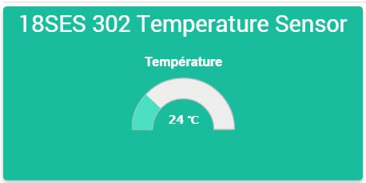

Secure SES 302 "Température" 
============================

 \

-   **Le module**

 \

 \

-   **Le visuel Jeedom**

 \

 \

Resumen 
------

 \

La sonde SES302 permet la mesure de la température d'ambiance
intérieure. Elle est alimentée par 2 piles AA et est certifiée Z-Wave
Plus. En plus de sa fonction principale, il est possible de câbler
différentes sondes externes SECURE sur le module, soit:

-   Une sonde de température externe NTC (SES001)

-   4 capteurs de température filaires pour tuyau ou réservoir (SES002)
    reliés par des câbles de 1m

-   1 capteur de température filaire pour tuyau ou réservoir (SES003)
    relié par un câble de 4m

Ces modules sont parfaits pour la mesure de température dans des
applications de contrôles de chauffage central ou toute autre
application similaire. Son interface utilisateur est simple, avec un
bouton-poussoir local et une LED d'indication sur la face arrière. On
peut facilement l'inclure / l'exclure dans un réseau Z-Wave.

 \

Fonctions 
---------

 \

-   Mesure précise de la température

-   Application dans des systèmes de contrôle dynamique de
    réservoirs/tubes/planchers chauffants/…​

-   Possibilité de brancher des sonde externes

-   Interopérable avec les produits et systèmes Z-Wave certifiés

-   Installation facile et rapide

-   Rapport de batterie faible

 \

Caractéristiques Techniques 
---------------------------

 \

-   Tipo: Portable/fixation murale

-   Plage de mesure de température: ±0.5°C pour 0°C à 40°C

-   Puce Z-Wave Plus

-   fréquence : 868,42 MHz

-   Alimentation: 2x piles AA (LR6)

-   Portée : jusqu'à 100 m en champ libre

-   Indice de protection : IP30

-   Dimensions : 86 x 85 x 30 mm

 \

Données du module 
-----------------

 \

-   Marque : Horstmann

-   Nombre : SES 302 Temperature Sensor

-   Fabricant ID : 89

-   Tipo produit : 13

-   Produit ID : 2

 \

configuración 
-------------

 \

Pour configurer le plugin OpenZwave et savoir comment mettre Jeedom en
inclusion référez-vous à cette
[documentation](https://jeedom.fr/doc/documentation/plugins/openzwave/fr_FR/openzwave.html).

 \

> **importante**
>
> Pour mettre ce module en mode inclusion il faut appuyer 1 seconde sur
> le bouton au dos et relacher, conformément à sa documentation papier.

 \

 \

Une fois inclus vous devriez obtenir ceci :

 \

 \

### comandos 

 \

Une fois le module reconnu, les commandes associées au module seront
disponibles.

 \

 \

Voici la liste des commandes :

 \

-   Température : c'est la commande de mesure de la température

-   Batterie : c'est la commande batterie

Plusieurs températures nons visibles sont aussi disponibles et seront
utiles si vous avez raccordé des sondes externes

 \

### configuración du module 

 \

> **importante**
>
> Lors d'une première inclusion réveillez toujours le module juste après
> l'inclusion.

 \

Ensuite il est nécessaire d'effectuer la configuration du module en
fonction de votre installation. Il faut pour cela passer par le bouton
"configuración" du plugin OpenZwave de Jeedom.

 \

 \

Vous arriverez sur cette page (après avoir cliqué sur l'onglet
Paramètres)

 \

 \

Détails des paramètres :

 \

-   1: Permet de régler de combien doit varier la température pour que
    le module l'envoie à Jeedom (par pas de 0.1)

-   2: Permet de régler l'intervalle de temps d'envoi de la température
    à Jeedom (en minutes)

Tous les autres paramètres sont identiques et correspondent à toutes les
sondes externes éventuellement branchées

 \

### Groupes 

 \

Ce module possède un seul groupe d'association, il est indispensable

 \

 \

Bon à savoir 
------------

 \

### Spécificités 

 \

### Visuel Alternatif 

 \

 \

Wakeup 
------

 \

Pour réveiller ce module il faut appuyer 1 fois sur le bouton au dos

 \

F.A.Q. 
------

 \

Ce module se réveille en appuyant 1 fois sur son bouton d'inclusion.

 \

Ce module est un module sur batterie, la nouvelle configuration sera
prise en compte au prochain wake up.

 \

Note importante 
---------------

 \

> **importante**
>
> Il faut réveiller le module : après son inclusion, après un changement
> de la configuration , après un changement de wake up, après un
> changement des groupes d'association

 \

**@sarakha63**
