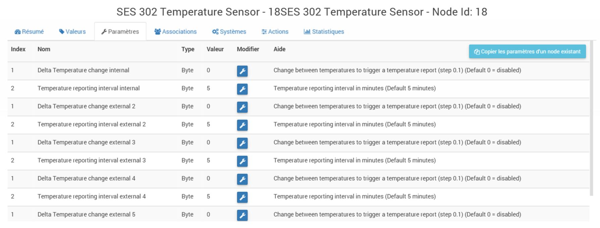

# Asegure la temperatura SES 302 ""

**El módulo**

**El visual de la libertad**

## Resumen

La sonda SES302 permite la medición de la temperatura ambiente interior. Está alimentado por 2 baterías AA y tiene certificación Z-Wave Plus. Además de su función principal, es posible conectar varias sondas seguras externas en el módulo, ya sea:

-   Un sensor de temperatura externo NTC (SES001)
-   4 sensores de temperatura con cable para manguera o tanque (SES002) conectados por cables de 1 m
-   1 sensor de temperatura con cable para manguera o tanque (SES003) conectado por un cable de 4 m

Estos módulos son perfectos para la medición de temperatura en aplicaciones de control de calefacción central o cualquier aplicación similar. Su interfaz de usuario es simple, con un botón local y un LED indicador en la parte trasera. Puede incluirlo / excluirlo fácilmente en una red Z-Wave.

## Fonctions

-   Medición precisa de temperatura
-   Aplicación en sistemas de control dinámico de tanques / tubos / suelos calentados /
-   Posibilidad de conectar sensores externos
-   Interoperable con productos y sistemas certificados Z-Wave
-   Instalación rápida y fácil
-   Informe de batería baja

## Características técnicas

-   Type: Portátil / montaje en pared
-   Rango de medición de temperatura: ± 0.5 ° C para 0 ° C a 40 ° C
-   Chip Z-Wave Plus
-   Frecuencia : 868.42 Mhz
-   Alimentation: 2 pilas AA (LR6)
-   Alcance : hasta 100 m en campo libre
-   Indice de PROTECCION : IP30
-   Dimensiones : 86 x 85 x 30 mm

## Datos del módulo

-   Hacer : Horstmann
-   Nombre : Sensor de temperatura SES 302
-   ID del fabricante : 89
-   Tipo de producto : 13
-   ID del producto : 2

## Configuration

Para configurar el complemento OpenZwave y saber cómo incluir a Jeedom, consulte esto [Documentación](https://doc.jeedom.com/es_ES/plugins/automation%20protocol/openzwave/).

> **Importante**
>
> Para poner este módulo en modo de inclusión, presione el botón en la parte posterior durante 1 segundo y suéltelo, de acuerdo con su documentación en papel.

Una vez incluido, deberías obtener esto :

### Commandes

Una vez que se reconoce el módulo, los comandos asociados con el módulo estarán disponibles.

Aquí está la lista de comandos :

-   Temperatura : es el comando de medición de temperatura
-   Batería : es el comando de la batería

Varias temperaturas no visibles también están disponibles y serán útiles si ha conectado sondas externas

### Configuracion del modulo

> **Importante**
>
> Durante una primera inclusión, siempre active el módulo justo después de la inclusión.

Entonces es necesario configurar el módulo de acuerdo con su instalación. Para hacer esto, vaya al botón "Configuración" del complemento OpenZwave de Jeedom.

Llegará a esta página (después de hacer clic en la pestaña Configuración)

Detalles del parámetro :

-   1: Le permite establecer cuánto debe variar la temperatura para que el módulo lo envíe a Jeedom (en pasos de 0.1)
-   2: Le permite establecer el intervalo de tiempo para enviar la temperatura a Jeedom (en minutos)

Todos los demás parámetros son idénticos y corresponden a todas las sondas externas posiblemente conectadas

### Groupes

Este módulo tiene solo un grupo de asociación, es esencial

## Wakeup

Para activar este módulo, presione el botón en la parte posterior una vez

## Nota importante

> **Importante**
>
> Tienes que despertar el módulo : después de su inclusión, después de un cambio en la configuración, después de un cambio en el despertar, después de un cambio en los grupos de asociación
