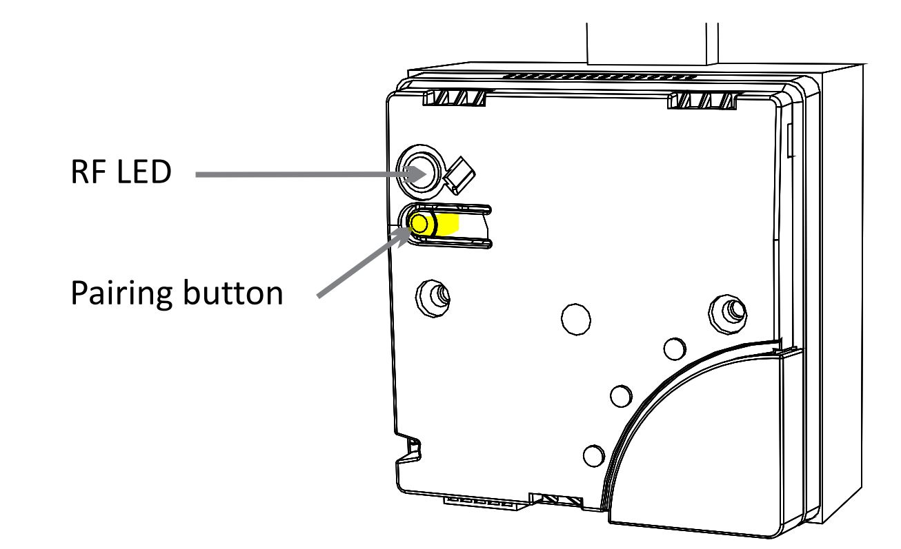
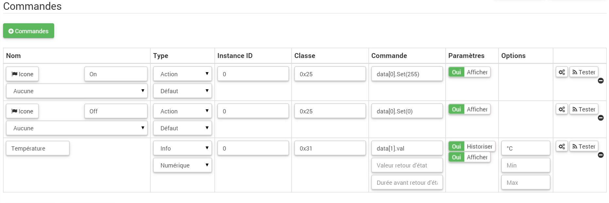

Temporizador seguro SIR 321 "" 
======================

\

-   **El módulo**

\

\

-   **El visual de la libertad**

\

\

Resumen 
------

\

El temporizador digital SIR321 es un simple cambio a
botón pulsador que recuerda apagar sus dispositivos por usted
electrico. Grandes ahorros de energía son posibles al agregar
este dispositivo simple en cualquier dispositivo eléctrico de alta potencia,
con cargas de hasta 3kW? (resistivas).

Estas unidades son perfectas para usar en paneles
calentadores, calentadores de inmersión, calentadores de toallas y enfriadores de aceite. El
el impulso varía de 30 a 120 minutos.

SIR 321 admite sensores de temperatura externos SES001,
SES002 y SES003.

\

Funciones 
---------

\

-   Booster para calentador de inmersión, radiador de panel, toallero calentado,
    radiador de baño de aceite

-   Temporizador de caldera

-   Ventilación forzada en salas de conferencias.

-   Medición de la temperatura del suelo radiante (con sensores opcionales)

-   Simple de usar y confiable

-   Ahorrar energía

\

Características técnicas 
---------------------------

\

-   Tipo?: Temporizador electrónico

-   Relé?: 13 (3) A, 230 V CA, adecuado para cargas de hasta
    3kW?

-   Suministro?: 230 V CA, 50 Hz

-   Dimensiones 85x85x44mm

-   Indice de PROTECCION : IP30?

-   Temperatura de funcionamiento: 0 ° C a 35 ° C

\

Datos del módulo 
-----------------

\

-   Hacer : Horstmann?

-   Nombre? : Temporizador de cuenta regresiva RF SIR 321

-   ID del fabricante : 89

-   Tipo de producto : 1/2 (dependiendo de si se incluye con una sonda
    o no)

\

Configuración 
-------------

\

Para configurar el complemento OpenZwave y saber cómo poner Jeedom en
inclusión refiérase a esto
[Documentación](https://jeedom.fr/doc/documentation/plugins/openzwave/es_ES/openzwave.html).

\

> **Important**
>
> Para poner este módulo en modo de inclusión, presione 1 segundo en
> el botón (hasta que parpadee rápidamente) y suéltelo, de acuerdo con
> documentación en papel.

\

\

Una vez incluido, deberías obtener esto :

\

\

### Comandos? 

\

Una vez que el módulo ha sido reconocido, los comandos asociados con el módulo serán
disponibles.

\

\

Aquí está la lista de comandos :

\

-   Uno? : este es el comando para encender el relé

-   Apagado? : es el comando para apagar el relé

-   Temperatura : este es el comando de medición de temperatura si un
    sonda externa está presente

\

### Configuracion del modulo 

\

Si desea configurar el módulo, debe pasar por el botón
"Configuración "del complemento OpenZwave de Jeedom.

\

\

Llegará a esta página (después de hacer clic en la pestaña
configuraciones)

\

\

Detalles del parámetro :

\

-   1: Le permite activar o no la función de temporizador a prueba de fallas (consulte
    documentación del módulo)

-   2: Ajusta la unidad de temperatura.

-   3: Le permite configurar el intervalo de tiempo de envío de temperatura
    en Jeedom (en segundos)

-   4: Ajusta cuánto debe variar la temperatura para
    el módulo lo envía a Jeedom (en pasos de 0.1 10- → 0.1)

-   5: Le permite establecer una temperatura de corte por encima de la cual
    el módulo cortará el relé

\

### Grupos 

\

Este módulo tiene dos grupos de asociación.. Si el primero es
esencial, el segundo está activo y es esencial si una sonda
de temperatura está relacionado.

\

Faq. 
------

\

**@sarakha63**
