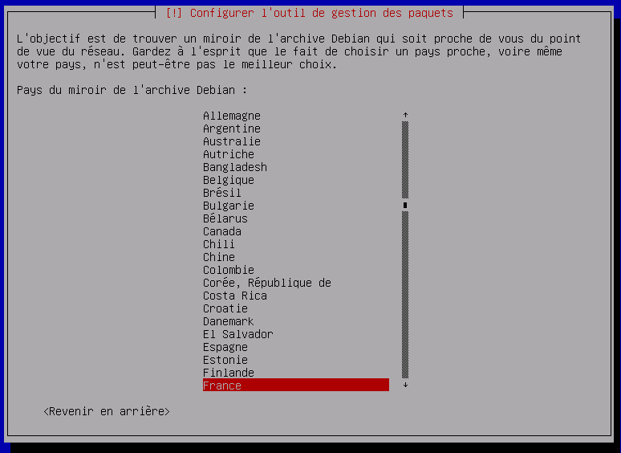
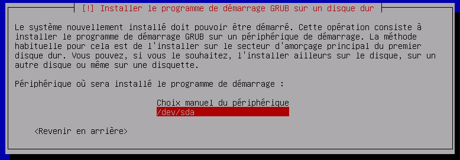

# Installation de debian

Nous allons voir ici comment installer une Debian, aussi bien en tant que VM ou en installation directe sur une machine physique

# Récupération des sources

Vous pouvez trouver la dernière version Debian en netinstall (taille minimale mais besoin d’internet pour l’installation) [ici](https://www.debian.org/CD/netinst) (il faut prendre l’image en amd64) ou cliquer directement [ici](http://cdimage.debian.org/debian-cd/10.4.0/amd64/iso-cd/debian-10.4.0-amd64-netinst.iso) pour télécharger l’iso.

# Lancement de l’installation

## Sur une machine physique

Il faut soit graver l’iso sur un CD et mettre le CD dans la machine (mais de nos jour les lecteurs CD sont de plus en plus rares) ou alors créer une clef USB bootable.

Pour la clef USB bootable il faut télécharger rufus [là](http://rufus.akeo.ie/downloads/rufus-2.9.exe), le lancer et le configurer comme cela :

> **Note**
>
> Pensez bien à sélectionner le fichier ISO que vous avez téléchargé juste avant

Il ne vous reste plus qu’à cliquer sur démarrer, puis mettre la clef USB sur la machine et la faire booter dessus.

## Sur une VM

La manipulation est assez simple, vous créez une nouvelle machine virtuelle, vous branchez, mettez un lecteur CD virtuel dessus qui pointe vers l’iso (pensez bien à le connecter) et vous lancez la machine. Voir [ici](https://doc.jeedom.com/fr_FR/howto/doc-howto-vmware.creer_une_vm.html) pour plus de détails.

# Installation

Appuyez sur entrée pour lancer l’installation :

Choisissez "French" et validez par la touche entrée

Ici il faut choisir "French" (Français)

Idem :

Entrez le nom de votre machine (ici nabaztag mais si c’est un jeedom mettez jeedom)

Appuyez juste sur entrée :

Mettez un mot de passe, je vous en conseille un simple ici (comme oooo), il pourra être changé plus tard (commande passwd) :

Remettez-le même :

Donnez le nom de l’utilisateur principal (ici nabaztag mais si c’est un jeedom mettez jeedom)

Remettez la même chose :

Mettez un mot de passe, je vous en conseille un simple ici (comme oooo), il pourra être changé plus tard (commande passwd) :

Remettez la même chose :

Validez en appuyant sur entrée :

Idem :

A nouveau validez en appuyant sur entrée :

On valide encore :

Et encore :

Choisissez "France" et validez :

Validez en appuyant sur entrée :

Idem :

Et encore (oui on valide beaucoup sur une installation de debian) :

Maintenant plus compliqué, il faut désélectionner "environnement de bureau Debian" en appuyant sur la touche espace et sélectionner "serveur SSH" en appuyant sur espace (il faut se déplacer avec les flèches du clavier), puis valider en appuyant sur entrée :

On valide à nouveau :

Il faut choisir /dev/sda puis valider :

Là vous avez juste à retirer la clef USB, le cdrom ou le cdrom virtuel et à appuyer sur entrée :

Voilà votre installation de debian est finie. Vous pouvez arrêter le tuto là si vous le voulez ou suivre les étapes suivantes pour quelques modifications du système (utile surtout pour jeedom).

# Optimisation pour Jeedom

Pour préparer l’installation de Jeedom vous pouvez faire quelques optimisations :

## Ajouter vim et sudo

``sudo apt-get install -y vim sudo``

## Ajouter fail2ban

Fail2ban est un logiciel qui permet de sécuriser l’accès à votre debian, en cas d’un trop grand nombre d’échecs de connexion il bloque l’accès à l’IP en question (donc pas à tout le monde, seulement à l’attaquant) un certain temps.

``sudo apt-get install -y fail2ban``

## Ajouter les Open VMware Tools

Les Open VMware Tools installent les drivers spécifiques au système d’exploitation installé et apportent les optimisations de cet OS hébergé sur un hyperviseur ESXi.

``sudo apt-get install -y open-vm-tools``

Il ne vous reste plus qu’à installer Jeedom en suivant [ceci](https://doc.jeedom.com/fr_FR/installation/cli)
