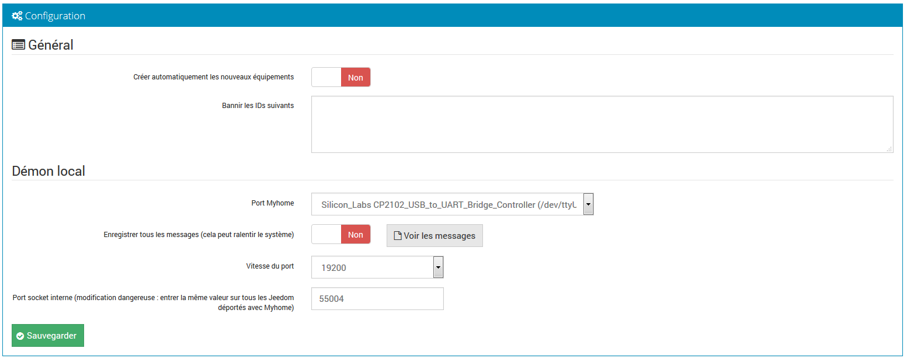
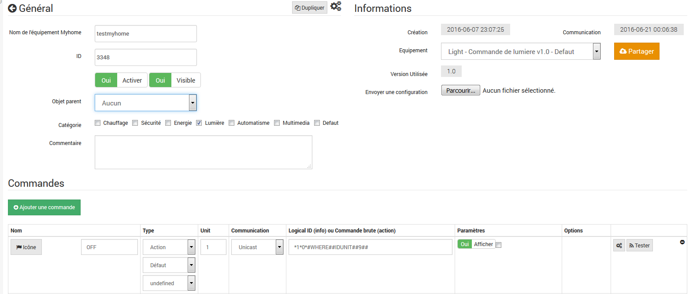
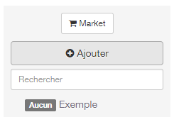
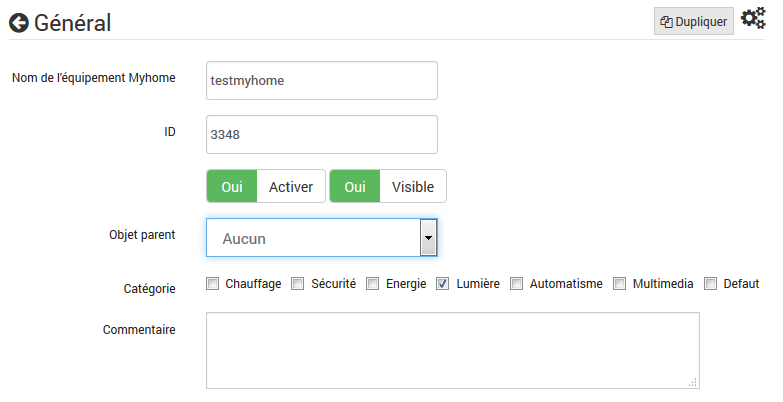
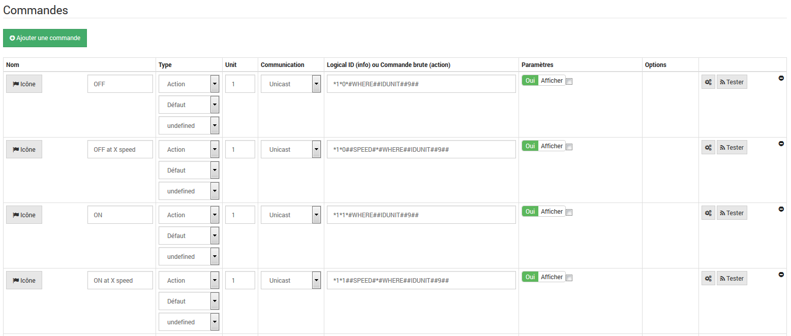

# MyHomeSCS 

Plugin permettant d’utiliser la passerelle F454

# Configuration 

Le plugin MyHomeSCS permet de dialoguer avec l’ensemble des périphériques MyHomeSCS de Legrand via la gateway F454

>**ATTENTION**
>
>Afin d'utiliser le plugin, il est nécessaire de désactiver l'authentification de la passerelle MyHome et d'autoriser l'adresse IP de JEEDOM dans la liste blanche de la passerelle.

Après l’avoir téléchargé sur le Market, il sera nécessaire de configurer l’ip et les ports utilise pour se connecter à la passerelle F454. Le port de socket interne : 55005 est le port par défaut utilisé par le daemon MyHomeSCS. Il vaut mieux éviter de le changer sans connaitre le fonctionnement du daemon.

Une fois configuré, on accède à la page du plugin MyHomeSCS.

A gauche, la liste des modules MyHomeSCS, et au centre les onglets Général, Information et Commandes.

Le menu à gauche présente l’ensemble des modules MyHomeSCS détectés et/ou configurés sur son installation domotique. Pour l’instant le plugin détecte les modules Legrand, mais ne les reconnait pas automatiquement. Une fois que Jeedom a détecté le nouveau module, il va le créer, mais sans lui affecter de commande. Pour cela, il sera nécessaire soit de choisir un module dans la liste déroulante complétement à droite (si le module existe dans la base de données), soit de créer les commandes une à une.

Le bouton "Ajouter équipement" permet d’ajouter des équipements spécifiques MyHomeSCS, en générale pour des tests ou des commandes de type "Managements" ou "Spéciales".

Lorsqu’on passe en mode Expert, on a accès à d’autres options : Type de commande, unit, type de communication, trame brute.

Le champ type permet de choisir entre une commande de type action ou une commande de type info, le type de l’action ou de l’info (Action, curseur, message, etc…) et l’action (ON, OFF, etc…). Le champ unit permet de saisir l’unit utilisée pour la commande ou pour le retour d’état. Le champ communication permet de choisir le type de communication (Multicast, Unicast ou Broadcast). Le champ LogicalID ou commande brute permet de nommer l’info ou de renseigner la trame "brute".

L’onglet Information précise le type de l’équipement.

L’onglet général permet de choisir le nom de l’équipement, sa destination dans l’arborescence de sa domotique, la catégorie du module (dans le jargon Legrand : WHO), la possibilité de rendre inactif le module dans Jeedom, ou encore de rendre visible ou invisible le module dans l’interface.

L’onglet Commandes détaille l’ensemble des commandes (certains éléments ne sont disponibles qu’en mode expert).

Ces commandes sont automatiquement remplies si on choisit le type de module dans le champ "Equipements". Les paramètres utiles sont Historiser, Afficher(la commande), Evènement (permet de forcer la demande d’info sur le module).

Dans une prochaine version et avec l’aide de tous, on pourrait imaginer que les modules soient reconnus automatiquement

## Liste des modules testés 

- Volets roulants : F401
- DALI : F429
- Dimmer : F418
- Switch 4x : F411
- Détecteur de mouvements : 0 672 26

## Ajouter un Equipement 

La plupart des équipements sont rajoutés dans le plugin MyHomeSCS dès qu’ils sont détectés

Une fois le module créé dans le plugin, deux solutions s’offrent à vous.

Soit le module existe dans le menu déroulant : Equipement et là il suffit de le choisir, puis de faire sauvegarder pour que les commandes soit automatiquement ajoutées.

Soit le module n’existe pas (encore) dans le plugin et alors il vous faudra créer les commandes une à une.

Les commandes info sont nécessaires pour récupérer l’état de l’équipement. Exemple pour les modules light, une info "bouton" est créée et permet de connaitre l’état du bouton du module (ON ou OFF par exemple). Cette info permet notamment de gérer les widgets ou est utilisée pour le déclenchement de scénarios

Les commandes actions permettent d’effectuer des actions sur l’équipement. En fonction de la catégorie de l’équipement, vous aurez différents choix.

Les trames Legrand s’orientent autour de 3 variables et sont sous la forme (pour une trame de type BUS-COMMAND) \*WHO\*WHAT\*WHERE\#\#

Le WHO correspond à la catégorie (lumière, automatisme, etc…). Si dans la trame brute vous saisissez \#WHO\\\#, celle-ci sera remplacée par l’ID de la catégorie de l’équipement.

Le WHAT correspond à l’ID de l’action. Si vous saisissez \#WHAT\\\#, cette variable sera remplacée par le code correspondant de la commande choisie.

Enfin, le WHERE correspond à la concaténation du mode de communication (unicast, multicast, broadcast), de l’ID.UNIT et du media(*9 pour le Zigbee). Dans mon plugin, vous pouvez saisir \\\#WHERE* qui sera remplacé par le code correspondant au type de communication choisi et vous pouvez saisir \#IDUNIT\# qui sera remplacé par l’UNIT correspondant au 4 derniers digits de l’adresse mac du module convertit en décimal suivi de l’ID sur deux digits.

En gros, cela donne ``\*\#WHO\\\#\\\*\#WHAT\\\#\*\#WHERE\\\#\#IDUNIT\\\#\#\#``

En dehors de ces variables, vous pouvez saisir la trame brute directement, par exemple : ``\*2\*2\*\#121301\#9\#\#``

Pour connaitre tous les types de trames, valeur WHO, WHAT, WHERE, les types de communication ou les codes media, vous pouvez vous reporter au document Legrand : Open Web Net Zigbee

Une fois que vous avez créé toutes les commandes de votre équipement, il est possible de créer un fichier "Equipement" au format JSON. Pour cela, vous pouvez vous inspirer des modules existants.

Ensuite vous pourrez le partager avec la communauté (grâce à la fonction : Envoyer une configuration). Cela permettra de rajouter les commandes en automatique pour les prochains utilisateurs du plugin MyHomeSCS.

Merci à vous.

# FAQ 

Essayer de le démarrer en mode debug pour voir l’erreur

Attendez une minute pour voir si le problème persiste, si c’est le cas
en ssh faites : "sudo rm /tmp/myhomescscmd.pid"

Cela veut dire que le deamon est démarré mais que Jeedom n’arrive pas à
le stopper. Vous pouvez soit redémarrer tout le système, soit en ssh
faire "killall -9 myhomescs.py"

Assurez-vous d’avoir bien coché la case pour la création automatique des
équipements, vérifiez que le deamon est bien en marche. Vous pouvez
aussi le redémarrer en debug pour voir s’il reçoit bien les messages de
vos équipements
