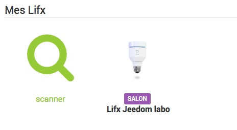

# Plugin Lifx 

Plugin permettant d’interagir avec les ampoules Lifx (en Local)

# Installer le Plugin 

Après installation du plugin, il vous suffit de l’activer :

**Dépendances**

Normalement les dépendances sont lancées automatiquement, si non il vous faudra cliquer sur **relancer**

# Configuration : Scanner votre réseau 

**Configuration**

Pour configurer le plugin, vous devez scanner votre réseau automatiquement via le plugin.

Pour Ajouter des Lifx automatiquement : **Plugins** -→ **Objets communicants** -→ **Lifx** -→ **Scanner**

Une fois le scan fini, vous verrez les Lifx détectées.

Vous pouvez alors pour les activer cliquer sur une des Lifx (qui a pris le nom que vous lui avez donné sur l’application Lifx), puis l’activer et sauvegarder pour avoir toutes les commandes associées à votre Lifx.

**Partie dashboard** :

# Créer un nouveau mode Couleur 

Si une couleur que l’on applique avec l’application Lifx nous plaît, on peut facilement la récupérer dans le plugin Lifx.

Il suffit pour cela de se rendre dans **Plugins** -→ **Objets communicants** -→ **Lifx** -→ puis choisir la lifx où on souhaite copier la couleur

Puis après cliquez sur **tester** sur la commande **Créer un mode**

Il suffit de recharger la page pour voir apparaître une nouvelle commande qui a en configuration la couleur actuelle de la Lifx. Vous pouvez à tout moment changer son nom.

