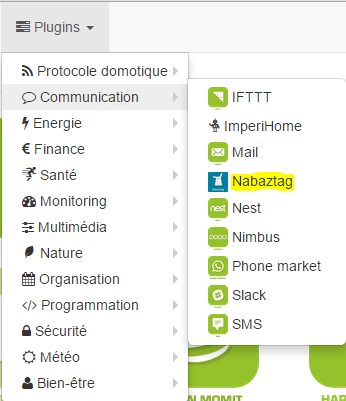
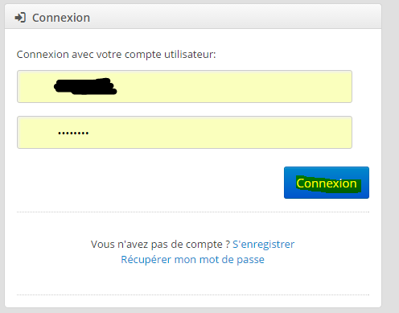
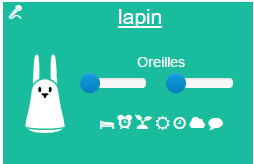

Plugin pour commander le Nabaztag.

Configuration 
=============

Configuration des équipements 
=============================

Une fois le plugin installé et activé à partir du Market, on accède à la
page du plugin Nabaztag par :

Vous retrouvez ici tous vos équipements Nabaztag :

> **Tip**
>
> Comme à beaucoup d’endroit sur Jeedom, placer la souris tout à gauche
> permet de faire apparaître un menu d’accès rapide (vous pouvez à
> partir de votre profil le laisser toujours visible).

Une fois un équipement sélectionné vous obtenez :

Vous retrouvez ici toute la configuration de votre équipement :

-   **Nom de l’équipement Nabaztag** : nom de votre équipement Nabaztag

-   **Objet parent** : indique l’objet parent auquel appartient
    l’équipement

-   **Catégorie** : les catégories de l’équipement (il peut appartenir à
    plusieurs catégories)

-   **Activer** : permet de rendre votre équipement actif

-   **Visible** : le rend visible sur le dashboard

-   **Adresse (openjabnab.fr ou @IP)** : adresse openjabnab ou IP (DNS)
    de votre openjabnab si vous l’auto-hébergez

-   **Adresse MAC** : adresse mac de votre lapin (voir plus bas)

-   **Token d’API Violet** : token de l’api (voir plus bas)

En dessous vous retrouvez la liste des commandes :

-   le nom affiché sur le dashboard

-   afficher : permet d’afficher la donnée sur le dashboard

-   configuration avancée (petites roues crantées) : permet d’afficher
    la configuration avancée de la commande (méthode
    d’historisation, widget…​)

-   Tester : permet de tester la commande

La liste des commandes est la suivante :

-   **Debout** : Permet de réveiller le lapin

-   **Redemarrer** : Permet de redémarrer le lapin

-   **Coucher** : Permet de dire au lapin d’aller se coucher

-   **Qualité de lair** : Donne la qualité de l’air (nécessite
    l’activation du plugin correspondant dans openjabnab)

-   **Ephéméride** : Donne les ephémérides (nécessite l’activation du
    plugin correspondant dans openjabnab)

-   **Horloge parlante** : Donne l’heure (nécessite l’activation du
    plugin correspondant dans openjabnab)

-   **Météo** : Donne la météo (nécessite l’activation du plugin
    correspondant dans openjabnab)

-   **Dicton** : Donne un dicton (nécessite l’activation du plugin
    correspondant dans openjabnab)

-   **Oreille gauche** : Permet de choisir la position de l’oreille
    gauche (16 positions possibles)

-   **Oreille droite** : Permet de choisir la position de l’oreille
    droite (16 positions possibles)

-   **Parle** : Permet de faire dire une phrase au lapin

Récupérer l’adresse max et le token 
===================================

Allez sur le site [openjabnab](http://openjabnab.fr/ojn_admin/index.php)
puis connectez-vous à votre compte :

Cliquez sur lapin :

Puis cliquez sur API :

Ici activez l’api violet et public et récupérez l’addresse mac ainsi que
la clef api violet pour la mettre dans la configuration de votre lapin
sur Jeedom

Widget 
======

Voici le widget obtenu après création de l’équipement :

Changelog détaillé :
<https://github.com/jeedom/plugin-nabaztag/commits/stable>
