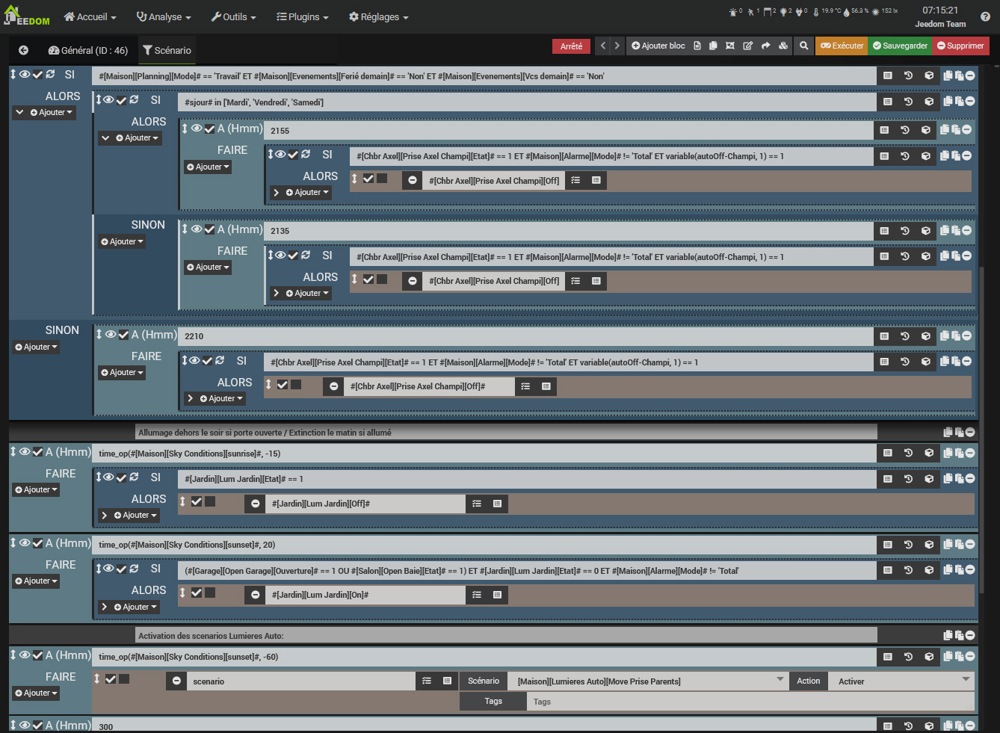

# Présentation

Jeedom est un logiciel Open-Source gratuit qui peut s'installer sur n'importe quel système Linux. Il est basé sur un coeur avec de multiples fonctionnalités : gestion de scénarios simple et avancée, interaction avec l'installation domotique de manière textuelle et sonore, visualisation d'historique et génération de courbes et graphiques, mise en relation de tous les équipements et objets connectés, personnalisation de l'interface...

Jeedom ne nécessite pas l'accès à des serveurs extérieurs pour fonctionner. Toute votre installation se gère en local et vous êtes donc les seuls à y avoir accès pour vous garantir une confidentialité complète.

Grâce à sa flexibilité et aux nombreux paramètres de personnalisation, chaque utilisateur peut créer sa propre domotique Jeedom. A l'aide des widgets, des vues et des design, vous avez une totale liberté pour imaginer votre propre interface si vous le souhaitez.

Jeedom permet de nombreuses possibilités dont :

- Gérer la sécurité des biens et des personnes,
- Automatiser le chauffage pour un meilleur confort et des économies d'énergie,
- Visualiser et gérer la consommation énergétique, pour anticiper une dépense et réduire les consommations,
- Communiquer par la voix, des SMS, des mails ou des applications mobiles,
- Gérer tous les automatismes de la maison, volets, portail, lumières, etc.,
- Gérer ses périphériques multimédia audio et vidéo, et ses objets connectés.

Jeedom repose sur le Core (le noyau), embarquant la structure et les fonctions centrales.

Différents [plugins](https://market.jeedom.com) peuvent alors proposer de nouvelles fonctions.

Le Core comprend entre autres :

## Dashboard / Synthèse

*Les équipements, comprenant des actionneurs ou des capteurs, sont organisés par objets. Les objets peuvent, par exemple, représenter des pièces physiques*.

## Historiques

*Toutes les informations sont historisables (courbe de température, consommation, ouvertures de porte, etc), et accessibles dans Analyse → Historique ou depuis les tuiles du Dashboard.*

## Scénarios

*Les scénarios permettent d'automatiser tout ou partie de vos équipements. Ils sont construits avec différents blocs. Des blocs conditionnels (Si Alors, Sinon), d'actions, de programmation (DANS x minutes ou A hhmm), de boucle, de commentaire, ou de code php. Tous les blocs sont imbricables les uns dans les autres, offrant des possibilités infinies.*

## Création de widgets

*Jeedom propose un moteur de création de Widgets pour les commandes des équipements. Vous pouvez ainsi créer vos propres Widgets, en plus des Widgets de base. La création de Widgets est aussi possible directement à partir de code, pour les utilisateurs avancés.*

## Interactions

*Le système d’interaction dans Jeedom permet de réaliser des actions à partir de commandes textes ou vocales.*

## Centre de Mise à jour

*Le centre de mise à jour permet de mettre à jour toutes les fonctionnalités de Jeedom, incluant le logiciel de base (core) et ses plugins. D’autres fonctions de gestion des extensions sont disponibles (supprimer, réinstaller, vérifier, etc.).*

# Market

Autour de ce noyau viennent se greffer des plugins, qui peuvent être de toutes sortes :

-   Protocole domotique (Z-Wave, RFXcom, EnOcean…),
-   Protocole IP (KNX,xPL…),
-   Objet communiquant (Nest, Netatmo…),
-   Haut niveau (alarme, thermostat…),
-   Interface (widget),
-   Organisation (agenda, Google agenda),
-   Développement (script).

Ces plugins peuvent être installés depuis le Market et permettent d’étendre les possibilités de Jeedom.

Jeedom permet à n’importe quel plugin de discuter avec un autre sur une base normalisée. Cela permet par exemple d’utiliser les plugins thermostat ou alarme avec n’importe quel protocole domotique ou même un plugin IP ou objet communiquant…

