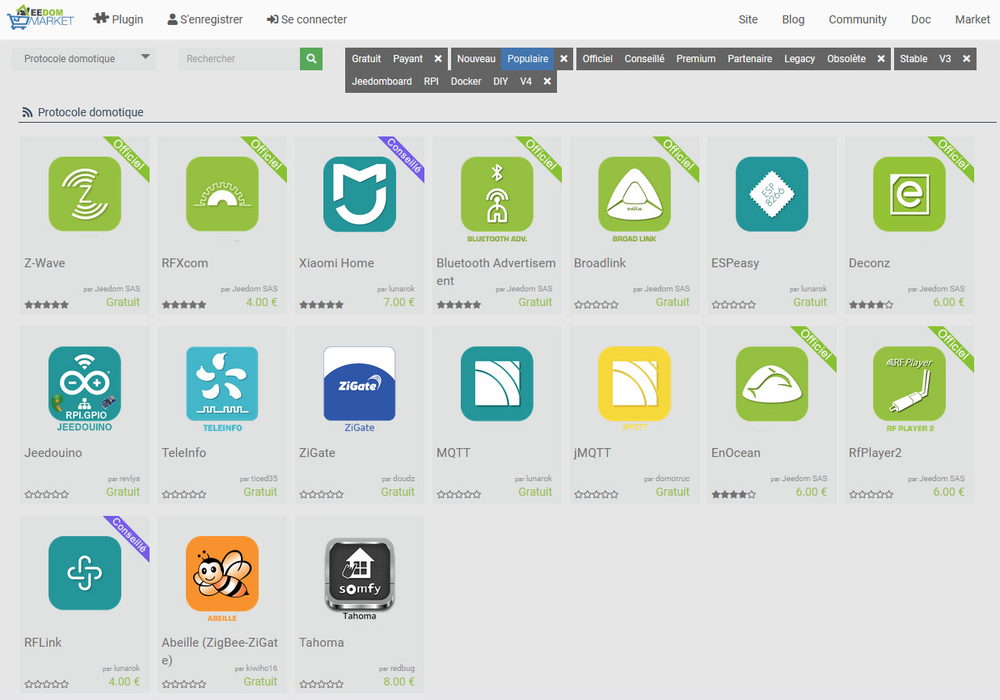

Présentation
===

Jeedom est une solution domotique Open-Source et *cloudless* (sans serveur dans le cloud). Il fonctionne sans abonnement, ce qui permet de garantir le fonctionnement de votre domotique sans internet, ainsi que la sécurité de vos données. Il est également extrêmement ouvert, multi-protocoles, personnalisable, et fortement évolutif.

Jeedom propose un noyau, le Core, embarquant la structure et les fonctions centrales.

Différents (plugins)[https://market.jeedom.com] peuvent alors proposer de nouvelles fonctions.

Le Core comprend notamment:

- L'accès au Dashboard ou à la Synthèse.

*Les équipements, comprenant des actionneurs ou des capteurs, sont organisés par objets. Les objets peuvent, par exemple, représenter des pièces physiques*.

- Un moteur de scénario particulièrement complet.

Les scénarios sont construits avec différents blocs. Des blocs conditionnels (Si Alors, Sinon), d'actions, de programmation (DANS x minutes ou A hhmm), de boucle, de commentaire, ou de code php. Tous les blocs sont imbricables les uns dans les autres, offrant des possibilités infinies.

- L'historisation des informations.

Toutes les informations sont historisables, et accessibles dans Analyse → Historique ou depuis les tuiles du Dashboard.

- Un moteur d'interactions.

- La gestion des mise à jours (Core et Plugins) et des sauvegardes.

Market
===

Autour de ce noyau viennent se greffer des plugins, qui peuvent être de toutes sortes :

-   Protocole domotique (Z-Wave, RFXcom, EnOcean…),
-   Protocole IP (KNX,xPL…),
-   Objet communiquant (Nest, Netatmo…),
-   Haut niveau (alarme, thermostat…),
-   Interface (widget),
-   Organisation (agenda, Google agenda),
-   Développement (script).

Ces plugins peuvent être installés depuis le Market et permettent d’étendre les possibilités de Jeedom.

Jeedom permet à n’importe quel plugin de discuter avec un autre sur une base normalisée. Cela permet par exemple d’utiliser les plugins thermostat ou alarme avec n’importe quel protocole domotique ou même un plugin IP ou objet communiquant…

Liens
===

Plusieurs tutoriels vidéo ont été réalisés afin de montrer les fonctionnalités importantes de Jeedom, faciliter son utilisation et familiariser l’utilisateur avec le logiciel.

Cependant depuis la réalisation de ces tutoriels, l’interface de Jeedom a pu évoluer et des fonctionnalités ajoutées. La documention reste donc la référence à consulter en cas de besoins, questions, etc.

Voici la liste des tutoriels disponibles :

-   [Tuto Jeedom 1 : Premier démarrage](https://www.youtube.com/watch?v=UTECRBGEUtI)
-   [Tuto Jeedom 2 : Débuter avec Jeedom (Objet, Market, Plugin, Module)](https://www.youtube.com/watch?v=2LU1neNvbus)
-   [Tuto Jeedom 3 : Jeedom, les Widget, Mails et Scénarios](https://www.youtube.com/watch?v=OJn33XbpiH8)
-   [Tuto Jeedom 4 : Jeedom, Utilisation du plugin Agenda](https://www.youtube.com/watch?v=EBuvIabg3Cc)
-   [Tuto Jeedom 5 : Les scripts dans Jeedom à l’aide du plugin Script](https://www.youtube.com/watch?v=FRbQILAogX0)
-   [Tuto Jeedom 6 : Les scénarios dans Jeedom avec le plugin Météo](https://www.youtube.com/watch?v=w0ErP3wyEoA)
-   [Tuto Jeedom 7 : Présentation du plugin Energie](https://www.youtube.com/watch?v=DZfA_DxqbNs)
-   [Tuto Jeedom 8 : Découverte du Mode Plan](https://www.youtube.com/watch?v=2IkXF6CBCAE)
-   [Tuto Jeedom 9 : Plugin DataTransfert, les Backups Auto et Dropbox](https://www.youtube.com/watch?v=wLOfJygFc8k)
-   [Tuto Jeedom 10 : Faire parler Jeedom (Android)](https://www.youtube.com/watch?v=3Pc3VJFWHo4)
-   [Tuto Jeedom 11 : Vitrine découverte d’une installation standard](https://www.youtube.com/watch?v=hW1d1FvkmSs)
-   [Tuto Jeedom 12 : Découverte du plugin Thermostat](https://www.youtube.com/watch?v=T21gqp1SQK0)
-   [Tuto Jeedom 13 : Découverte du plugin Alarme](https://www.youtube.com/watch?v=JjnWeU614gc)
-   [Tuto Jeedom 14 : Découverte des Interactions](https://www.youtube.com/watch?v=Z8SHo_Xwk0Q)
