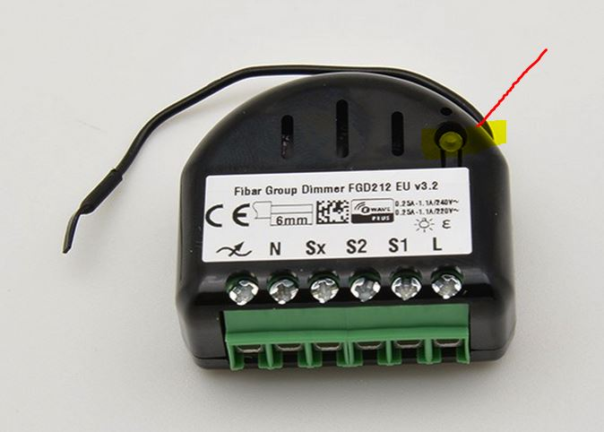

Fibaro Dimmer2 - FGD-212 
========================

-   **Le module**

-   **Le visuel Jeedom**

Résumé 
------

Le micromodule variateur FGD-212 va vous permettre de contrôler une
lampe ou plafonnier à distance grâce au protocole Z-Wave tout en
conservant votre interrupteur existant.

Vous allez donc pouvoir actionner la lampe connectée et faire varier son
intensité en utilisant l’interrupteur existant, un émetteur Z-Wave ou
directement depuis le bouton présent sur le micromodule.

Le nouveau variateur Fibaro FGD-212 est équipé d’un algorithme de
détection intelligente de la source lumineuse qui facilite la
configuration et assure une grande compatibilité de l’appareil. Il
dispose d’une auto-protection contre la surcharge et de la fonction de
démarrage progressif. Dans le cas de sources lumineuses non graduables,
seule la fonction ON/OFF est possible (en raccordement à 3 fils).

Il est compatible avec tout type de lampes supportant la variation ou
non. En plus de la fonction variation, ce micromodule peut également
mesurer la consommation électrique de la charge connectée. Les valeurs
de consommation instantanée (en W) et la consommation électrique totale
(en kWh) peuvent être consultées.

Fonctions 
---------

-   Commander un éclairage à distance

-   S’installe derrière un interrupteur existant

-   Fonction ON/OFF et Variation

-   Utilisation en mode 2 fils (neutre pas nécessaire)

-   Intègre la puce Z-Wave série 500

-   Communication 250% plus rapide comparé à des périphériques Z-Wave
    standard

-   Détection automatique de la charge

-   Protégé contre les surcharges

-   Compatible avec tous les contrôleurs Z-Wave et Z-Wave+

-   Fonction mesure de la puissance active et de l’énergie

-   Fonctionne avec différents types d’interrupteurs - poussoir,
    bascule, à trois voies, etc.

-   Fonction démarrage progressif (Soft-start)

-   Diode LED d’indication d’état de l’inclusion, d’étalonnage et
    niveaux de MENU

-   Testeur de portée Z-Wave intégré

-   Détecte automatiquement les défauts de câblage, température élevée,
    ampoule grillée, les surtensions et les surcharges

-   Options de configuration avancée

-   Petit, discret et esthétique

-   Facilité d’utilisation et d’installation

Caractéristiques techniques 
---------------------------

-   Type de module : Récepteur Z-Wave

-   Alimentation : 230V +/- 10%, 50Hz

-   Consommation : 1.3W

-   Câblage : neutre pas nécessaire

-   Charge maxi : 50-250W (charge résistive) ou 0.25-1.1A
    (charge inductive)

-   Type de lampe compatible (dimmable) : Incandescente, Fluocompacte,
    Halogène (230VAC et 12VDC avec tranformateur électronique), LED

-   Type de lampe compatible (non dimmable) : Fluocompacte, LED

-   Fréquence : 868,42 Mhz

-   Puissance du signal : 1mW

-   Distance de transmission : 50m champ libre, 30m en intérieur

-   Dimensions : 42.5 x 38.25 x 20.3mm

-   Température de fonctionnement : 0-35°C

-   Température limite : 105°C

-   Normes : RoHS 2011/65/EU, LVD 2006/95/EC, EMC 2004/108/EC, R&TTE
    1999/5/EC

Données du module 
-----------------

-   Marque : Fibar Group

-   Nom : FGD212 Dimmer 2

-   Fabricant ID : 271

-   Type Produit : 258

-   Produit ID : 4096

Configuration 
-------------

Pour configurer le plugin OpenZwave et savoir comment mettre Jeedom en
inclusion référez-vous à cette
[documentation](https://doc.jeedom.com/fr_FR/plugins/automation%20protocol/openzwave/).

> **Important**
>
> Pour mettre ce module en mode inclusion il faut appuyer 3 fois sur le
> bouton d’inclusion, conformément à sa documentation papier. Si le
> module n’est pas déjà inclus, il se mettra en inclusion
> automatiquement lors de sa mise sous tension.

> **Tip**
>
> Si vous avez déjà intégré votre module au mur, vous pouvez l’inclure
> en faisant de nombreux allers-retours sur l’interrupteur ou de
> nombreux appuis si vous avez un interrupteur sur bouton poussoir.

Une fois inclus vous devriez obtenir ceci :

### Commandes 

Une fois le module reconnu, les commandes associées aux modules seront
disponibles.

Voici la liste des commandes :

-   Intensité : C’est la commande qui permet de régler l’intensité de la
    lumière

-   On : C’est la commande qui permet d’allumer la lumière

-   Off : C’est la commande qui permet d’éteindre la lumière

-   Etat : C’est la commande qui permet de connaitre le statut de la
    lumière

-   Consommation : C’est la commande qui permet de remonter la
    consommation du module

-   Puissance : C’est la commande qui permet de remonter la puissance
    instantanée du module

A noter que sur le dashboard toutes les infos se retrouvent sur le même
icone

### Configuration du module 

Vous pouvez effectuer la configuration du module en fonction de votre
installation. Il faut pour cela passer par le bouton "Configuration" du
plugin OpenZwave de Jeedom.

Vous arriverez sur cette page (après avoir cliqué sur l’onglet
paramètres)

Détails des paramètres :

EN COURS DE REDACTION

### Groupes 

Ce module possède cinq groupes d’association, seul le premier est
indispensable.

Bon à savoir 
------------

### Spécificités 

> **Caution**
>
> Le paramètre le plus important de la configuration est le 20. Il
> permet de choisir le type d’interrupteur utilisé. Par défaut le type
> est défini sur monostable.

Si vous voulez exclure/inclure le module sans démonter votre
interrupteur, vous pouvez appuyer plusieurs fois sur votre interrupteur
(ou faire des allers-retours en cas d’interrupteur bistable)

### Visuel alternatif 

Wakeup 
------

Pas de notion de wakeup sur ce module.

F.A.Q. 
------

Non. ce module peut s’inclure ou s’exclure en appuyant plusieurs fois
sur l’interrupteur.

**@sarakha63**
