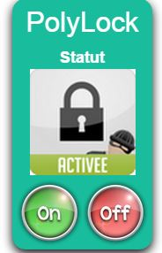

# PolyLock

**Le module**

**Le visuel Jeedom**

Résumé
------

Sécurisez votre maison en utilisant la serrure électronique Z-Wave de Poly-Control !

La serrure électronique Poly-Lock est prévue pour s’adapter à presque toutes les portes dans le monde. Elle se monte très facilement en 5 minutes, il faut juste changer le cylindre de votre porte.

Une fois couplé à votre contrôleur Z-Wave (tel que les systèmes Vera de VeraControl), vous pouvez avoir un contrôle complet de votre serrure depuis n’importe quel ordinateur ou smartphone, peu importe où vous soyez dans le monde. Il est également possible d’utiliser la serrure avec le clavier sans fil Poly-Pad pour ouvrir ou verrouiller la porte.

Il est donc possible de verrouiller votre maison d’une manière similaire à verrouiller votre voiture - avec une télécommande, en appuyant simplement sur un bouton et votre maison est sécurisée. La serrure Poly-Control peut également fonctionner avec d’autres scènes Z-Wave, où les lumières s’allument, et le système d’alarme est désactivé lorsque déverrouillé via votre télécommande.

Le système Poly-Control peut être utilisé dans un environnement domestique ou de travail. La serrure Poly-Lock est alimentée par batterie, et a été testée pour fonctionner pendant 1 an, sans remplacement de la batterie.

Fonctions
---------

-   Contrôlez votre porte d’entrée à distance
-   S’adapte à la plupart des portes
-   Peut s’intégrer dans des scènes Z-Wave, par exemple pour un système d’alarme
-   Convient à un usage domestique ou d’entreprise
-   Molette pour fermeture manuelle
-   Installation facile

Caractéristiques techniques
---------------------------

-   Alimentation : Pile Lithium-Chloride 3.6V
-   Fréquence : 868,42 Mhz
-   Portée : jusqu’à 100 m à l’extérieur, jusqu’à 30 m dans les bâtiments
-   Dimensions : 120 x 52 x 60 mm (L x l x h)
-   Poids : 370g

Données du module
-----------------

-   Marque : Poly-Control
-   Nom : Polylock
-   Fabricant ID : 270
-   Type Produit : 1
-   Produit ID : 1

Configuration
-------------

Pour configurer le plugin OpenZwave et savoir comment mettre Jeedom en inclusion référez-vous à cette [documentation](https://doc.jeedom.com/fr_FR/plugins/automation%20protocol/openzwave/).

> **Important**
>
> Pour mettre ce module en mode inclusion il faut appuyer 1 fois sur le bouton d’inclusion, conformément à sa documentation papier.

Une fois inclus vous devriez obtenir ceci :

### Commandes

Une fois le module reconnu, les commandes associées au module seront disponibles.

Voici la liste des commandes :

-   Statut : c’est la commande qui remontera la dernière action éxécutée (ouvrir/fermer)
-   Ouvrir : c’est la commande qui permet d’ouvrir la serrure
-   Fermer : c’est la commande qui permet de fermer la serrure
-   Batterie : c’est la commande batterie

### Configuration du module

> **Warning**
>
> Bien que ce module soit sur batterie il utilise la technologie Flirs. Cela veut dire qu’il n’a pas de notion de wake up et de réveil. Il récupérera toutes modifications de configutation en quasi temps réel comme un module secteur.

Si vous voulez effectuer la configuration du module en fonction de votre installation, il faut pour cela passer par la bouton "Configuration" du plugin OpenZwave de Jeedom.

Vous arriverez sur cette page (après avoir cliqué sur l’onglet paramètres)

Détails des paramètres :

-   0: permet de changer le sens de rotation pour les commandes ouvrir/fermer
-   1: permet de définir combien de temps va tourner la serrure pour ouvrir (0 à 15 s)
-   2: permet de définir combien de temps va tourner la serrure pour fermer (0 à 15 s)
-   3: permet de définir la vitesse de rotation de la serrure (0 à 15, 15 étant le plus lent)
-   4: permet de choisir parmi différents modes de fonctionnement (couple, force, puissance etc…​)

### Groupes

Ce module possède un seul groupe d’association.

Exemples d’utilisation
----------------------

L’élément déclencheur est la commande évènement d’un clavier zipato (cela peut être n’importe quoi d’autre). Si la valeur est 6 (home) on ferme la porte à clé. En effet on vient de rentrer donc on peut fermer la porte à clé. Sinon (forcément 5) on ouvre la porte à clé et 2 minutes après on la referme. En effet, on veut sortir, la porte s’ouvre et se refermera peu de temps après.

Bon à savoir
------------

### Spécificités

> **Tip**
>
> Bien que ce module soit sur batterie il utilise la technologie Flirs. Cela veut dire qu’il n’a pas de notion de wake up et de réveil. Il récupérera toutes modifications de configutation en quasi temps réel comme un module secteur.

> **Tip**
>
> Ce module ne renvoit pas son état, si vous actionnez la serrure à la main l’état restera le même.

### Visuel alternatif

Wake up
-------

Il n’y a pas de notion de wake up pour ce module.
